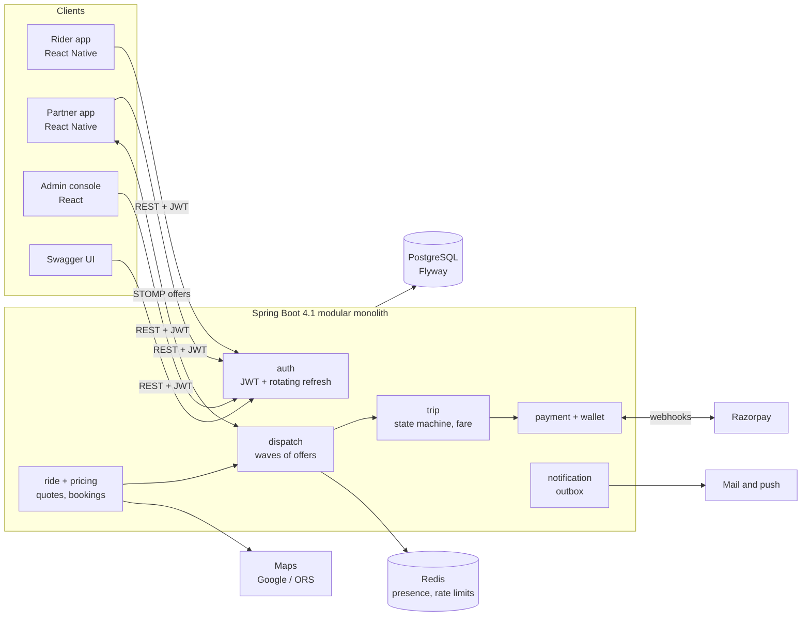

# RideX

[](https://github.com/kumarprince06/ridex-platform/actions/workflows/ci.yml)

### Ride-hailing backend in Java 21 and Spring Boot 4.1

RideX is the backend of a consumer ride-hailing platform: a rider books, the nearest available
driver is offered the ride, the trip runs through a validated state machine, and the fare is priced
from the distance actually driven. Payments, driver wallets, a shuttle line, support tickets and an
operations console sit on the same API. It is a modular monolith with one PostgreSQL database and
Redis, tested against real containers.

| | |
|---|---|
| **Live demo** | _Coming soon_ (`https://<demo-host>/swagger-ui.html`) |
| **API docs** | Swagger UI at `/swagger-ui.html` on any running instance; locally <http://localhost:8080/swagger-ui.html> |
| **Run it locally** | [Getting started](#getting-started) |

---

## Try it

### Demo accounts

The public demo runs with the `demo` profile, which seeds these accounts. All three use the
password **`RideX-demo-2026`**.

| Email | Role | Sign in with `"app"` |
|---|---|---|
| `rider@ridex.example` | Rider | `RIDER` |
| `driver@ridex.example` | Driver, approved and with a vehicle | `DRIVER` |
| `support@ridex.example` | Support agent | `ADMIN` |

- **Admin roles.** RideX also has `OPS_ADMIN` and `SUPER_ADMIN`, which approve drivers, change
  fares and issue refunds. They are not available on the public demo because its password is
  published; the support account can look at people, trips and tickets but change nothing that
  matters.
- **Sign-up.** The walkthrough below uses only the seeded accounts. Public sign-up sends a
  verification code by email, so on a demo without a mail provider configured, **a new account
  cannot be verified and cannot sign in**.
- **Resets.** All demo data goes back to the seeded state every night at 03:00 IST.

### Try the ride flow in 5 steps

Everything happens in Swagger UI. To act as someone, call `POST /api/v1/auth/login`, copy
`accessToken` from the response, press **Authorize** and paste it (without `Bearer`). Swagger holds
one token at a time, so you switch between the rider and the driver as you go.

**1. Rider: sign in and get a quote.** Log in as the rider and authorize, then call
`POST /api/v1/rides/estimate`:

```json
{ "pickupLat": 26.9239, "pickupLng": 75.8267, "destinationLat": 26.9196, "destinationLng": 75.7878 }
```

You get a price for every ride type. Copy one `estimateId`.

**2. Driver: go on duty at the pickup.** Log in as the driver and authorize, then call
`PUT /api/v1/driver/duty`:

```json
{ "onDuty": true, "latitude": 26.9239, "longitude": 75.8267 }
```

**3. Rider: book, within two minutes of step 2.** Switch back to the rider and call
`POST /api/v1/rides`. A driver's position counts as current for two minutes; if you take longer,
repeat step 2.

```json
{ "estimateId": "<from step 1>", "pickupAddress": "Hawa Mahal", "destinationAddress": "Jaipur Junction" }
```

The ride comes back `SEARCHING`; dispatch has already offered it to nearby drivers. Copy its `id`.

**4. Driver: accept the offer.** Switch to the driver, call `GET /api/v1/driver/offers`, then
`POST /api/v1/driver/offers/{offerId}/accept`. The response carries the `tripId`. On the demo an
offer stays open for five minutes.

**5. Driver: drive it; rider: read the receipt.** As the driver, call in order:

- `POST /api/v1/trips/{tripId}/arrive`
- `POST /api/v1/trips/{tripId}/start` with `{ "pickupCode": "<from the rider's ride>" }` (as the rider, `GET /api/v1/rides/{rideId}` shows it)
- `POST /api/v1/trips/{tripId}/complete` with `{ "distanceMeters": 4921, "durationSeconds": 1140 }`

Then, as the rider, `GET /api/v1/rides/{rideId}/receipt` compares the quote with the charge, line
by line. Report a longer distance at `complete` and the charge rises above the quote.

### How it fits together



---

## Status

**Architecture:** Modular monolith, one platform database
**Backend:** Java 21 + Spring Boot 4.1 · 172 endpoints · 249 tests
**Database:** PostgreSQL + Flyway (44 migrations, 50 tables) · Redis for presence and rate limits
**Clients:** two React Native apps and one React console, all on the same API

All sixteen modules on [the module board](docs/34-Module-Task-Board.md) are closed, including the
demo deployment (M8). What is deliberately left out is listed at the bottom of that board.

---

## Features working today

Each line below is implemented in `ridex-backend` and covered by tests in `src/test`.

- **Accounts** — rider and driver sign-up with email verification, JWT login, rotating refresh
  tokens, logout, password change that ends other sessions, account history
- **Driver onboarding** — profile, documents, vehicles, approval states, payout account
- **Fare estimates** — every active ride type priced from one route lookup, quote persisted
- **Dispatch** — offers to nearby on-duty drivers (Redis presence), search widening and expiry,
  one winner when two drivers accept the same ride
- **Trips** — pickup-code start with an attempt cap, waiting charges, distance sanity cap,
  receipt comparing quote to charge, every transition recorded with its actor
- **Payments** — cash and Razorpay online payments, webhook confirmation, idempotent settlement,
  driver paid on the gross fare
- **Driver wallet** — cancellation and no-show fees, debt limit that blocks offers, top-ups
- **Shuttle** — seat maps with one booking per seat, passes and pass plans, departure
  cancellation refunds as points
- **Points and referrals** — ledger-based balance, redemption, referral reward after the first ride
- **Ratings** — two-way rating, one per side per ride
- **Support** — tickets for riders and drivers, agent replies, internal notes, category priority
- **Notifications** — in-app feed, invoice PDF, real-time offers over authenticated STOMP
- **Admin** — permission-checked operations endpoints, search, staff management
- **Platform** — default-deny security, CORS and security headers, rate limiting, OpenAPI document,
  package boundaries enforced by ArchUnit

---

## Product decision

RideX is a consumer platform: riders and drivers sign up themselves, and operations manage the
marketplace from one console. Riders, drivers, fleets and operators are platform entities, not
isolated organisations.

An earlier design was organisation-scoped; [ADR-001](docs/20-ADRs.md) records why it was dropped
and why the schema carries no organisation column.

---

## Surfaces

| Surface | Location | State |
|---|---|---|
| Backend API | [ridex-backend/](ridex-backend/) | Rides, shuttle, payments, payouts, support, notifications |
| Rider mobile app | [ridex-rider-app/](ridex-rider-app/) | Book, follow and pay for a ride; shuttle seats and passes |
| Driver mobile app | [ridex-partner-app/](ridex-partner-app/) | Onboarding, duty, offers, trips, shuttle boarding, earnings |
| Admin / operations web | [ridex-admin-web/](ridex-admin-web/) | Live map, approvals, trips, payments, payouts, shuttle ops, support |

One repository on purpose. The API contract is shared, so a backend change and its client update
belong in the same commit; splitting them into separate repos only lets them drift.

---

## Architecture

Package by feature, one deployable:

```
com.ridex
├── auth/            AuthController, AuthService, repositories, dto/, domain/
├── rider/           rider profile
├── driver/          onboarding, documents
├── vehicle/         vehicles
├── maps/            MapsProvider port, dto/, domain/, google/
├── platform/        security, error handling — cross-cutting, owned by no feature
└── shared/          primitives used by more than one feature
```

Each feature owns its controller, service, repository, DTOs and domain model. `<feature>/domain/`
holds the entities and rules and imports no Spring, so fare maths and state machines test without
booting a context. A feature reaches another through its service, never at its `domain/` classes.

Enforced by `PackageStructureTest` (ArchUnit) — a violation fails the build.

System-level design: [docs/24-HLD-High-Level-Design.md](docs/24-HLD-High-Level-Design.md).
Class and table level: [docs/25-LLD-Low-Level-Design.md](docs/25-LLD-Low-Level-Design.md).
Module conventions: [docs/08-Backend-Architecture.md](docs/08-Backend-Architecture.md).

---

## Technology

**Backend** — Java 21, Spring Boot 4.1, Spring Security, Spring Data JPA, Flyway, PostgreSQL,
Redis, Maven

**Web** — React, TypeScript, Vite, TanStack Query, React Hook Form, Zod

**Mobile** — React Native, TypeScript, React Navigation, secure token storage

**Testing** — JUnit 5, Mockito, Spring Boot Test, Testcontainers, ArchUnit

Deliberately **not** used: Kafka, Kubernetes, microservices, a general event bus. Start as a
modular monolith with Redis; split only when scale or team boundaries justify it.

Full stack: [docs/19-Technology-Stack.md](docs/19-Technology-Stack.md).

---

## Getting started

**Prerequisites:** Java 21 and Docker. Maven comes with the repository as `./mvnw`.

On a fresh clone, Docker is the only service the tests need: no `.env` and no `docker compose`.

```bash
git clone https://github.com/kumarprince06/ridex-platform.git
cd ridex-platform/ridex-backend
./mvnw test                   # starts its own Postgres and Redis containers
```

To run the platform itself, from the repository root:

```bash
cp .env.example .env          # fill in the secrets; the app refuses to boot without a JWT key
docker compose up -d          # Postgres, Redis, Mailpit
./run.sh                      # exports .env, picks the project's JDK, starts the backend
```

`run.sh` exists because two things bite everybody once: Spring does not read `.env`, and a machine
with an older `JAVA_HOME` pinned for another project compiles this fine and then fails at startup
with `UnsupportedClassVersionError`. Running `./mvnw spring-boot:run` directly works too - the app
imports `../.env` itself and the build selects a Java 21 toolchain.

The clients:

```bash
cd ridex-admin-web  && npm install && npm run dev     # http://localhost:5174
cd ridex-rider-app  && npm install && npm run device  # Android over USB
cd ridex-partner-app && npm install && npm run device
```

Health check: `http://localhost:8080/actuator/health`
Local mail UI: `http://localhost:8025`

### Required environment

| Variable | Purpose |
|---|---|
| `RIDEX_APP_PASSWORD` | Postgres password for the `ridex_app` role |
| `RIDEX_JWT_SECRET` | JWT signing key, 32+ bytes. Required always — no default, and the app refuses to boot without it |

### Sending real mail

Locally every message goes to Mailpit and stops there, which is the point: a typo in an address
cannot reach a stranger. To deliver to real inboxes, point the same five variables at a relay —
no code changes, and nothing above `EmailChannel` knows the difference.

```bash
# Brevo, 300 mails a day on the free tier
export RIDEX_MAIL_HOST=smtp-relay.brevo.com
export RIDEX_MAIL_PORT=587
export RIDEX_MAIL_USERNAME=<your Brevo SMTP login>
export RIDEX_MAIL_PASSWORD=<your Brevo SMTP key>
export RIDEX_MAIL_AUTH=true
export RIDEX_MAIL_STARTTLS=true
export RIDEX_MAIL_FROM=no-reply@yourdomain.com
```

`RIDEX_MAIL_FROM` has to be an address the relay has verified. Sending as one it has not seen is
the single most common reason a message is accepted and then silently dropped.

---

## Deployment

One host runs the backend, Postgres, Redis and Caddy; the console is a static build on a CDN and
the apps are installed from EAS builds. The step-by-step is [deploy/README.md](deploy/README.md).

```bash
cd deploy
cp .env.production.example .env.production    # fresh secrets, not the development ones
docker compose -f docker-compose.prod.yml --env-file .env.production up -d
```

Merging to `main` builds the image, pushes it to GHCR and - once the host secrets exist - pulls and
restarts it there, waiting on the health check so a failed migration fails the deployment.

---

## Database

PostgreSQL, one schema. Flyway owns it; migrations live in
`ridex-backend/src/main/resources/db/migration` and are never edited after being applied to a
shared environment.

Conventions:

- ULID primary keys, `VARCHAR(26)`
- `TIMESTAMPTZ` for every instant, stored in UTC, converted at the edge
- Financial history is append-only — no destructive updates

Target model: [docs/09-Project-ERD.md](docs/09-Project-ERD.md).

---

## Security

- Short-lived JWT access tokens, rotating refresh tokens
- Refresh, verification and reset tokens stored hashed, never logged
- BCrypt password hashing
- Permission-based authorization, roles as the UI representation
- Default-deny on API routes; ownership checked on every client-supplied ID

Full policy: [docs/14-Security.md](docs/14-Security.md).

---

## Testing

Every task lands with its test. Unit tests for domain and application logic; integration tests
against real PostgreSQL for anything touching the schema; security tests asserting that protected
routes reject unauthenticated calls.

```bash
cd ridex-backend
./mvnw test          # 249 tests; needs only a running Docker daemon
```

Integration tests are annotated `@IntegrationTest`. That boots the application against one
Postgres 17 and one Redis 7 container, started by Testcontainers and wired in with
`@ServiceConnection`. The containers are shared by the whole run and removed when it ends, so tests
never touch the database the apps use. CI runs the same command, and Flyway applies every migration
on each run.

The three documents that describe the code are generated from it, so they cannot quietly drift:

```bash
java tools/DocGen.java api           > docs/10-API-Contract.md
java tools/DocGen.java erd           > docs/09-Project-ERD.md
java tools/DocGen.java notifications > docs/12-Notification-Matrix.md
```

---

## Documentation

| # | Document |
|---|---|
| 00 | [Project documentation index](docs/00-README.md) |
| 01 | [Project overview](docs/01-Project-Overview.md) |
| 02 | [Project requirements](docs/02-Project-Requirements.md) |
| 03 | [Use cases](docs/03-Use-Cases.md) |
| 04 | [Business rules](docs/04-Business-Rules.md) |
| 05 | [Functional requirements](docs/05-Functional-Requirements.md) |
| 06 | [Non-functional requirements](docs/06-Non-Functional-Requirements.md) |
| 07 | [Roles and permissions](docs/07-Roles-and-Permissions.md) |
| 08 | [Backend architecture](docs/08-Backend-Architecture.md) |
| 09 | [ERD](docs/09-Project-ERD.md) |
| 10 | [API contract](docs/10-API-Contract.md) |
| 11 | [State machines](docs/11-State-Machines.md) |
| 12 | [Notification matrix](docs/12-Notification-Matrix.md) |
| 13 | [Payment architecture](docs/13-Payment-Architecture.md) |
| 14 | [Security](docs/14-Security.md) |
| 15 | [Phase plan](docs/15-Phase-Plan.md) |
| 16 | [Edge cases and errors](docs/16-Edge-Cases-and-Errors.md) |
| 17 | [Differentiators](docs/17-RideX-Differentiators.md) |
| 18 | [Future ideas](docs/18-Future-Project-Ideas.md) |
| 19 | [Technology stack](docs/19-Technology-Stack.md) |
| 20 | [ADRs](docs/20-ADRs.md) |
| 22 | [Partner app design](docs/22-Partner-App-Design.md) |
| 23 | [Admin panel design](docs/23-Admin-Panel-Design.md) |
| 24 | [High-level design](docs/24-HLD-High-Level-Design.md) |
| 25 | [Low-level design](docs/25-LLD-Low-Level-Design.md) |
| 26 | [Build task list](docs/26-Build-Task-List.md) |
| 27 | [Unique feature set](docs/27-Unique-Feature-Set.md) |
| 31 | [Deployment and CI/CD](docs/31-Deployment-and-CI-CD.md) |
| 32 | [Business readiness and new lines](docs/32-Business-Readiness-and-New-Lines.md) |
| 34 | [Module task board](docs/34-Module-Task-Board.md) — the plan of record |
| 35 | [Runtime flow](docs/35-Runtime-Flow.md) |
| — | [Full documentation index](docs/PROJECT-DOCUMENTATION-INDEX.md) |

---

## Delivery rule

Phases were delivered one at a time: each was closed only once its happy path, failure path and
persistence behaviour worked end-to-end.

Phase breakdown: [docs/15-Phase-Plan.md](docs/15-Phase-Plan.md).
