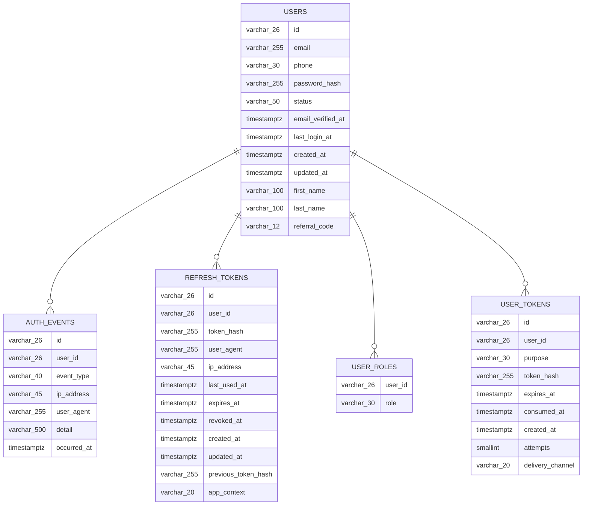
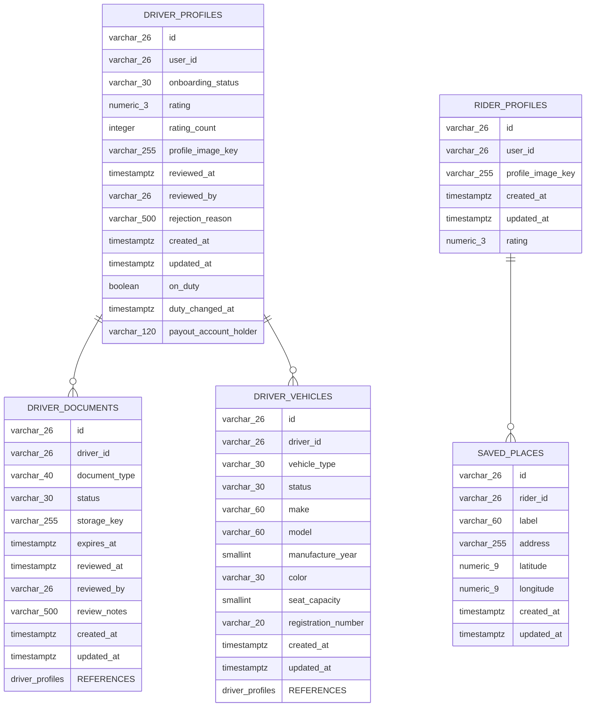
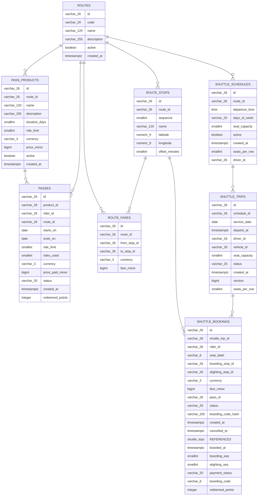
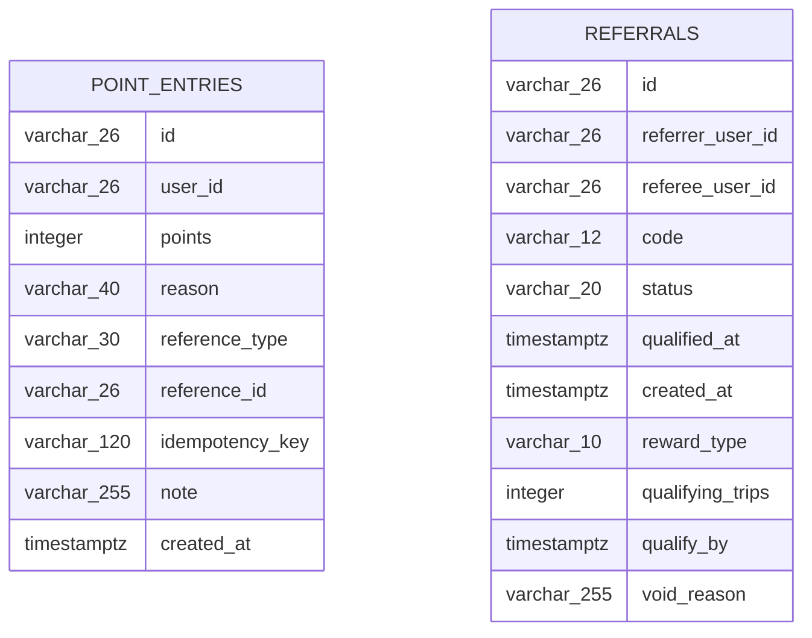
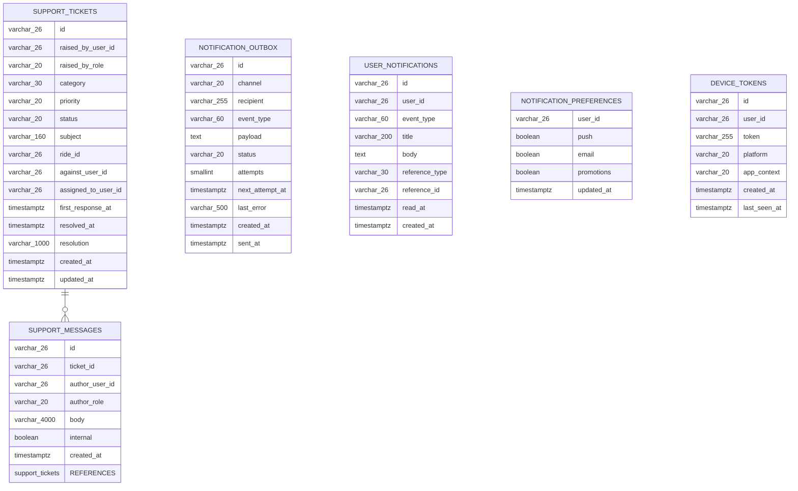
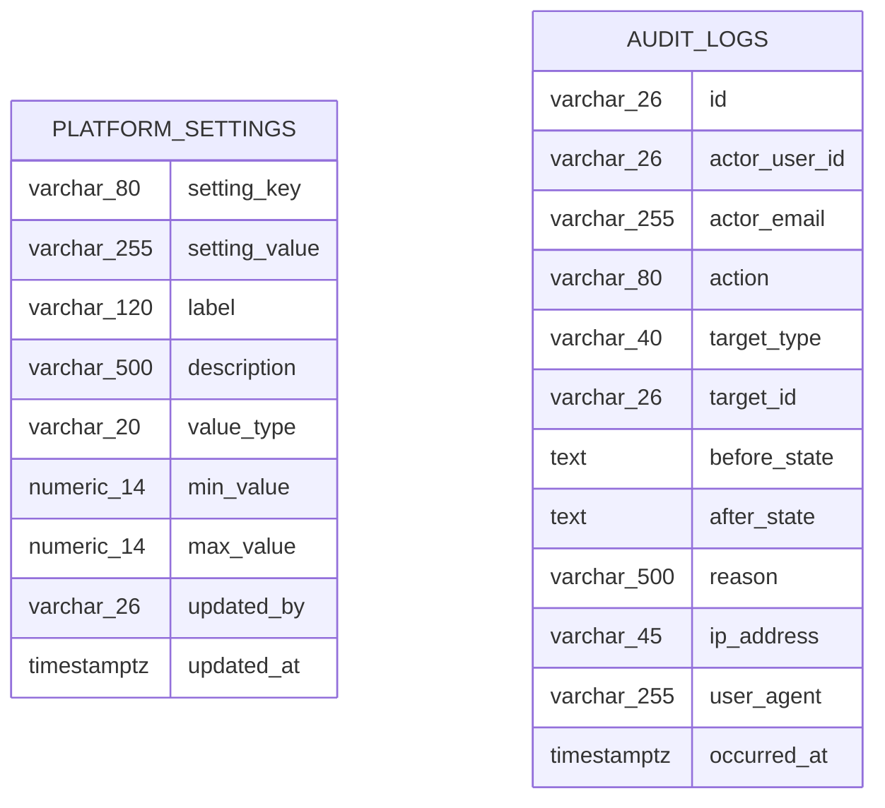
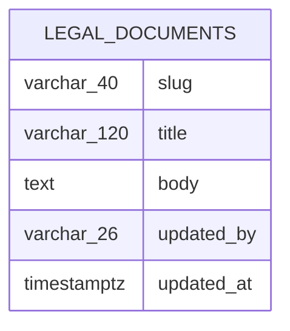

# RideX — ERD

**48 tables**, one platform database, no organisation column anywhere (ADR-001).

Generated from the code rather than maintained by hand:

```bash
java tools/DocGen.java erd > docs/09-Project-ERD.md
```

Generated on 2026-09-19 from `88b8a0e`.

## How to read it

- Every id is a ULID stored as `VARCHAR(26)`: sortable by creation time, and safe to
  generate before the row is written.
- Money is an integer of minor units next to an ISO currency. No floats.
- Nothing is deleted. Cancellations, refunds and points all append a row rather than
  rewriting the one that came before.

## Identity and access



## Riders and drivers



## Rides and dispatch

```mermaid
erDiagram
    FARE_ESTIMATES ||--o{ FARE_ESTIMATE_LINES : ""
    FARE_ESTIMATES ||--o{ RIDE_REQUESTS : ""
    RIDE_REQUESTS ||--o{ RIDE_OFFERS : ""
    RIDE_REQUESTS ||--o{ RIDE_RATINGS : ""
    RIDE_REQUESTS ||--o{ TRIPS : ""
    RIDE_TYPES ||--o{ FARE_ESTIMATES : ""
    RIDE_TYPES ||--o{ PRICING_RULES : ""
    RIDE_TYPES ||--o{ RIDE_REQUESTS : ""
    TRIPS ||--o{ TRIP_FARE_LINES : ""
    TRIPS ||--o{ TRIP_LOCATIONS : ""
    TRIPS ||--o{ TRIP_STATUS_HISTORY : ""
    RIDE_TYPES {
      varchar_26 id
      varchar_30 code
      varchar_60 display_name
      varchar_160 description
      smallint seat_capacity
      smallint sort_order
      boolean active
      timestamptz created_at
      timestamptz updated_at
    }
    PRICING_RULES {
      varchar_26 id
      varchar_26 ride_type_id
      varchar_3 currency
      bigint base_fare_minor
      bigint per_km_minor
      bigint per_minute_minor
      bigint minimum_fare_minor
      integer free_waiting_seconds
      bigint per_waiting_minute_minor
      numeric_4 surge_multiplier
      timestamptz valid_from
      timestamptz valid_to
      timestamptz created_at
      ride_types REFERENCES
      >= base_fare_minor
      per_minute_minor AND
      free_waiting_seconds AND
    }
    FARE_ESTIMATES {
      varchar_26 id
      varchar_26 rider_id
      varchar_26 ride_type_id
      numeric_9 pickup_lat
      numeric_9 pickup_lng
      numeric_9 destination_lat
      numeric_9 destination_lng
      integer distance_meters
      integer duration_seconds
      varchar_3 currency
      bigint total_minor
      numeric_4 surge_multiplier
      timestamptz expires_at
      timestamptz created_at
      rider_profiles REFERENCES
    }
    FARE_ESTIMATE_LINES {
      varchar_26 id
      varchar_26 fare_estimate_id
      varchar_30 line_type
      varchar_80 label
      bigint amount_minor
      varchar_3 currency
      smallint sort_order
      timestamptz created_at
      fare_estimates REFERENCES
    }
    RIDE_REQUESTS {
      varchar_26 id
      varchar_26 rider_id
      varchar_26 ride_type_id
      varchar_26 fare_estimate_id
      varchar_30 status
      numeric_9 pickup_lat
      numeric_9 pickup_lng
      varchar_255 pickup_address
      numeric_9 destination_lat
      numeric_9 destination_lng
      varchar_255 destination_address
      varchar_3 currency
      bigint quoted_fare_minor
      varchar_20 cancelled_by
      varchar_500 cancellation_reason
      bigint cancellation_fee_minor
      timestamptz cancelled_at
      timestamptz requested_at
      timestamptz updated_at
      bigint version
      rider_profiles REFERENCES
      fare_estimates REFERENCES
      is (cancelled_at
      _cancelled_at OR
      varchar_26 assigned_driver_id
      timestamptz assigned_at
      smallint search_wave
      integer redeemed_points
      bigint discount_minor
      varchar_20 payment_method
      varchar_40 cancellation_reason_code
    }
    RIDE_OFFERS {
      varchar_26 id
      varchar_26 ride_request_id
      varchar_26 driver_id
      varchar_20 status
      smallint wave
      integer distance_meters
      timestamptz offered_at
      timestamptz expires_at
      timestamptz responded_at
      ride_requests REFERENCES
      driver_profiles REFERENCES
    }
    TRIPS {
      varchar_26 id
      varchar_26 ride_request_id
      varchar_26 driver_id
      varchar_255 pickup_code_hash
      smallint pickup_code_attempts
      timestamptz arrived_at
      timestamptz started_at
      timestamptz completed_at
      integer waiting_seconds
      integer actual_distance_meters
      integer actual_duration_seconds
      varchar_3 currency
      bigint final_fare_minor
      timestamptz created_at
      timestamptz updated_at
      bigint version
      ride_requests REFERENCES
      is (started_at
      _completed_at AND
      varchar_6 pickup_code
    }
    TRIP_STATUS_HISTORY {
      varchar_26 id
      varchar_26 trip_id
      varchar_30 from_status
      varchar_30 to_status
      varchar_20 actor_type
      varchar_26 actor_id
      varchar_500 reason
      timestamptz occurred_at
      trips REFERENCES
    }
    TRIP_FARE_LINES {
      varchar_26 id
      varchar_26 trip_id
      varchar_30 line_type
      varchar_80 label
      bigint amount_minor
      varchar_3 currency
      smallint sort_order
      timestamptz created_at
    }
    TRIP_LOCATIONS {
      varchar_26 id
      varchar_26 trip_id
      numeric_9 latitude
      numeric_9 longitude
      timestamptz recorded_at
    }
    RIDE_RATINGS {
      varchar_26 id
      varchar_26 ride_id
      varchar_26 rider_id
      varchar_26 driver_id
      smallint stars
      varchar_500 comment
      timestamptz created_at
      smallint rider_stars
    }
    CANCELLATION_POLICIES {
      varchar_26 id
      varchar_20 cancelled_by
      varchar_30 from_status
      integer grace_seconds
      bigint fee_minor
      varchar_3 currency
      boolean active
      timestamptz created_at
    }
```

## Shuttle



## Money

```mermaid
erDiagram
    PAYMENTS ||--o{ PAYMENT_EVENTS : ""
    PAYMENTS ||--o{ REFUNDS : ""
    PAYMENTS {
      varchar_26 id
      varchar_26 trip_id
      varchar_26 rider_id
      varchar_20 method
      varchar_30 provider
      varchar_30 status
      varchar_3 currency
      bigint gross_amount_minor
      bigint discount_amount_minor
      bigint net_amount_minor
      varchar_120 provider_payment_id
      varchar_120 idempotency_key
      varchar_255 failure_reason
      timestamptz created_at
      timestamptz updated_at
      timestamptz paid_at
      bigint version
      >= gross_amount_minor
      varchar_26 shuttle_booking_id
      varchar_26 pass_id
    }
    PAYMENT_EVENTS {
      varchar_26 id
      varchar_26 payment_id
      varchar_30 provider
      varchar_160 provider_event_id
      varchar_60 event_type
      text payload
      timestamptz received_at
    }
    REFUNDS {
      varchar_26 id
      varchar_26 payment_id
      bigint amount_minor
      varchar_3 currency
      varchar_500 reason
      varchar_30 status
      varchar_120 provider_refund_id
      varchar_120 idempotency_key
      varchar_26 issued_by_user_id
      timestamptz created_at
      timestamptz completed_at
    }
    RIDER_DUES {
      varchar_26 id
      varchar_26 rider_id
      bigint amount_minor
      varchar_3 currency
      varchar_255 reason
      varchar_30 source_type
      varchar_26 source_id
      varchar_20 status
      varchar_26 settled_payment_id
      timestamptz created_at
      timestamptz settled_at
    }
    DRIVER_EARNINGS {
      varchar_26 id
      varchar_26 driver_id
      varchar_26 trip_id
      varchar_3 currency
      bigint gross_amount_minor
      numeric_5 commission_rate
      bigint commission_minor
      bigint net_amount_minor
      timestamptz created_at
      varchar_26 payout_id
    }
    DRIVER_PAYOUTS {
      varchar_26 id
      varchar_26 driver_id
      varchar_3 currency
      bigint amount_minor
      varchar_20 status
      timestamptz period_start
      timestamptz period_end
      varchar_100 reference
      varchar_500 failure_reason
      timestamptz created_at
      timestamptz settled_at
    }
    LEDGER_ENTRIES {
      varchar_26 id
      varchar_20 account_type
      varchar_26 account_id
      varchar_10 direction
      bigint amount_minor
      varchar_3 currency
      varchar_40 entry_type
      varchar_30 reference_type
      varchar_26 reference_id
      varchar_140 idempotency_key
      timestamptz created_at
    }
```

## Loyalty



## Support and comms



## Platform



## Other



## Across modules

Relationships whose two ends live in different sections above:

- `driver_earnings` → `driver_profiles` (Money → Riders and drivers)
- `driver_payouts` → `driver_profiles` (Money → Riders and drivers)
- `ride_offers` → `driver_profiles` (Rides and dispatch → Riders and drivers)
- `ride_ratings` → `driver_profiles` (Rides and dispatch → Riders and drivers)
- `shuttle_trips` → `driver_profiles` (Shuttle → Riders and drivers)
- `trips` → `driver_profiles` (Rides and dispatch → Riders and drivers)
- `shuttle_trips` → `driver_vehicles` (Shuttle → Riders and drivers)
- `support_tickets` → `ride_requests` (Support and comms → Rides and dispatch)
- `fare_estimates` → `rider_profiles` (Rides and dispatch → Riders and drivers)
- `passes` → `rider_profiles` (Shuttle → Riders and drivers)
- `payments` → `rider_profiles` (Money → Riders and drivers)
- `ride_ratings` → `rider_profiles` (Rides and dispatch → Riders and drivers)
- `ride_requests` → `rider_profiles` (Rides and dispatch → Riders and drivers)
- `rider_dues` → `rider_profiles` (Money → Riders and drivers)
- `shuttle_bookings` → `rider_profiles` (Shuttle → Riders and drivers)
- `driver_earnings` → `trips` (Money → Rides and dispatch)
- `payments` → `trips` (Money → Rides and dispatch)
- `audit_logs` → `users` (Platform → Identity and access)
- `device_tokens` → `users` (Support and comms → Identity and access)
- `driver_documents` → `users` (Riders and drivers → Identity and access)
- `driver_profiles` → `users` (Riders and drivers → Identity and access)
- `legal_documents` → `users` (Other → Identity and access)
- `notification_preferences` → `users` (Support and comms → Identity and access)
- `platform_settings` → `users` (Platform → Identity and access)
- `point_entries` → `users` (Loyalty → Identity and access)
- `referrals` → `users` (Loyalty → Identity and access)
- `refunds` → `users` (Money → Identity and access)
- `rider_profiles` → `users` (Riders and drivers → Identity and access)
- `support_messages` → `users` (Support and comms → Identity and access)
- `support_tickets` → `users` (Support and comms → Identity and access)
- `user_notifications` → `users` (Support and comms → Identity and access)
