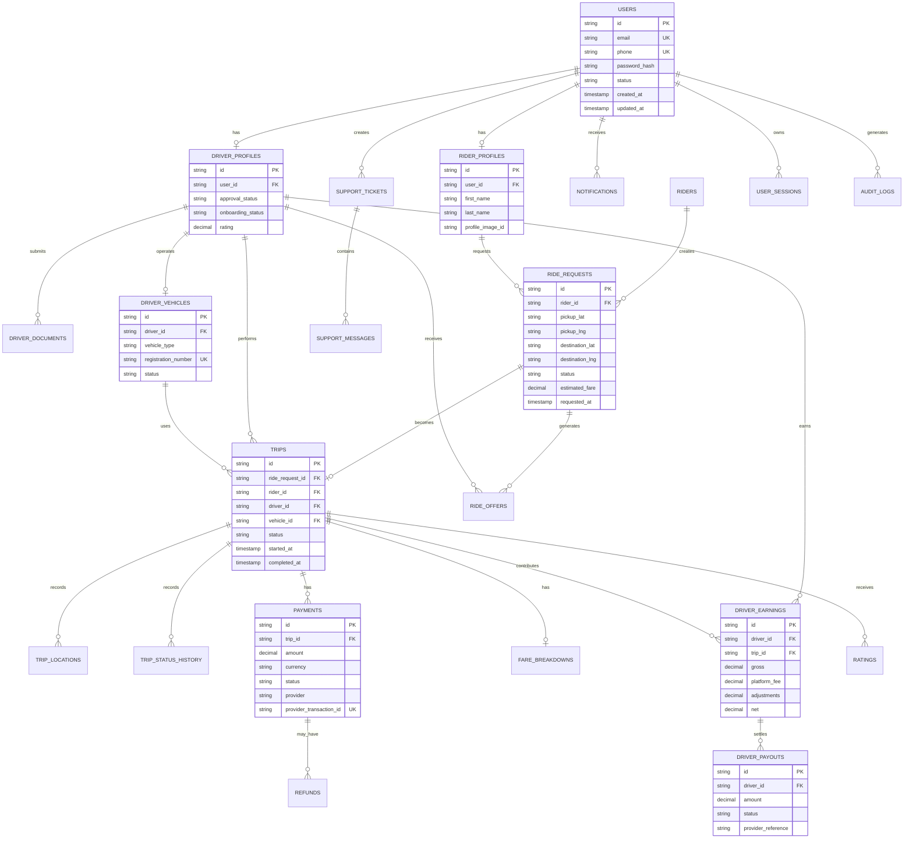

# RideX B2C — ERD

The following is the logical MVP ERD. It is intentionally not a tenant-per-database model.

## Later tables

- saved_places
- payment_methods
- promotions
- coupons
- scheduled_rides
- multi_stop_locations
- corporate_accounts
- wallets
- fraud_cases
- safety_incidents
- pricing_rules
- service_areas
- driver_incentives
