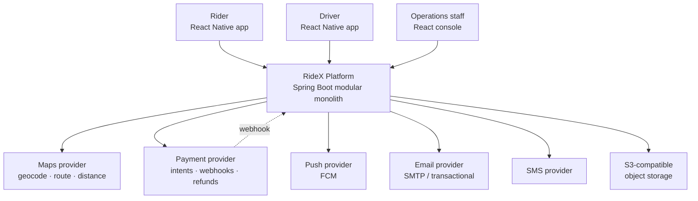
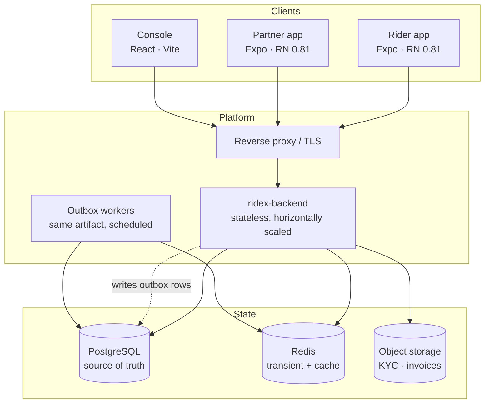
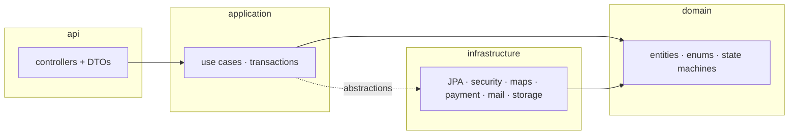
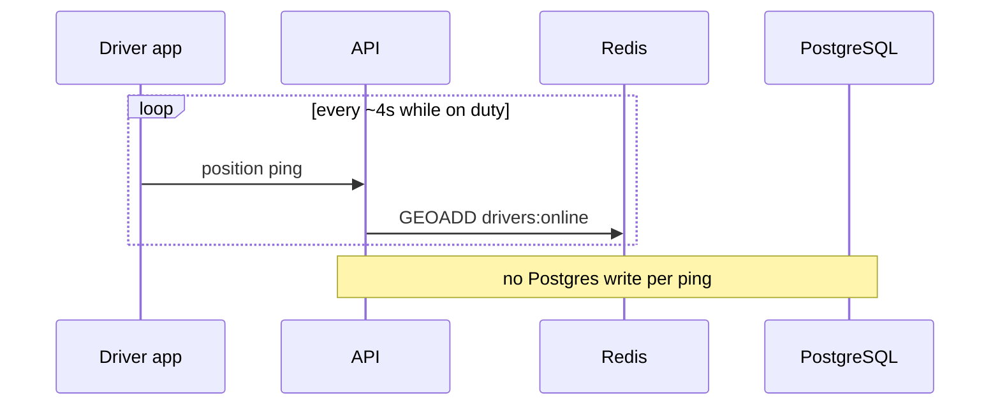
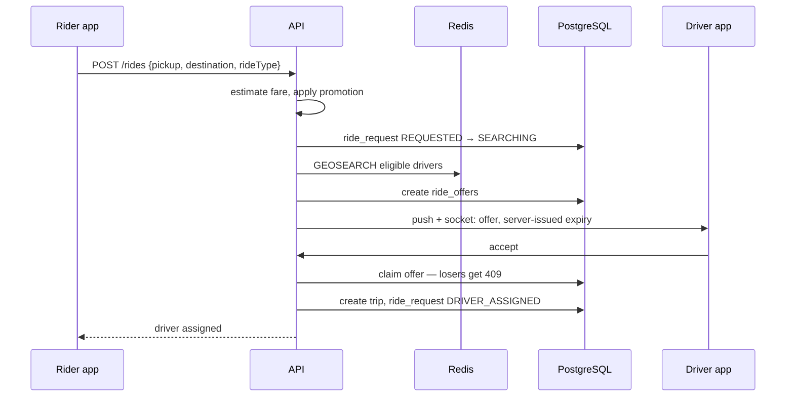
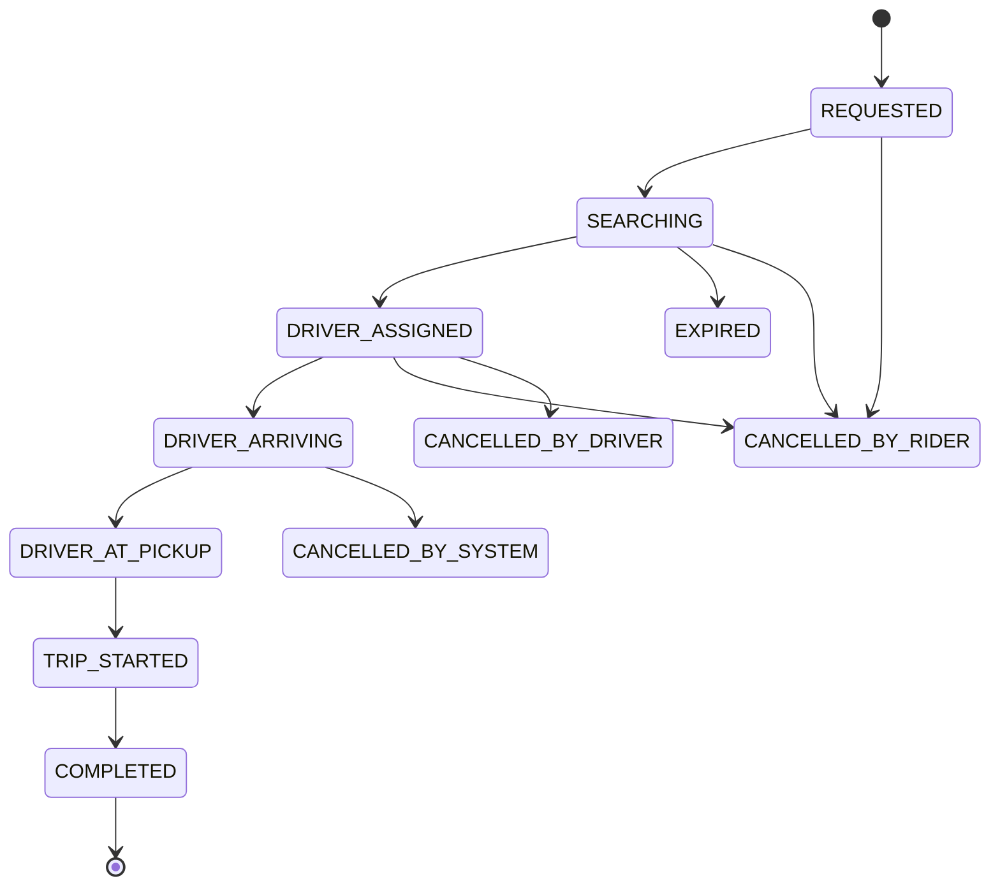
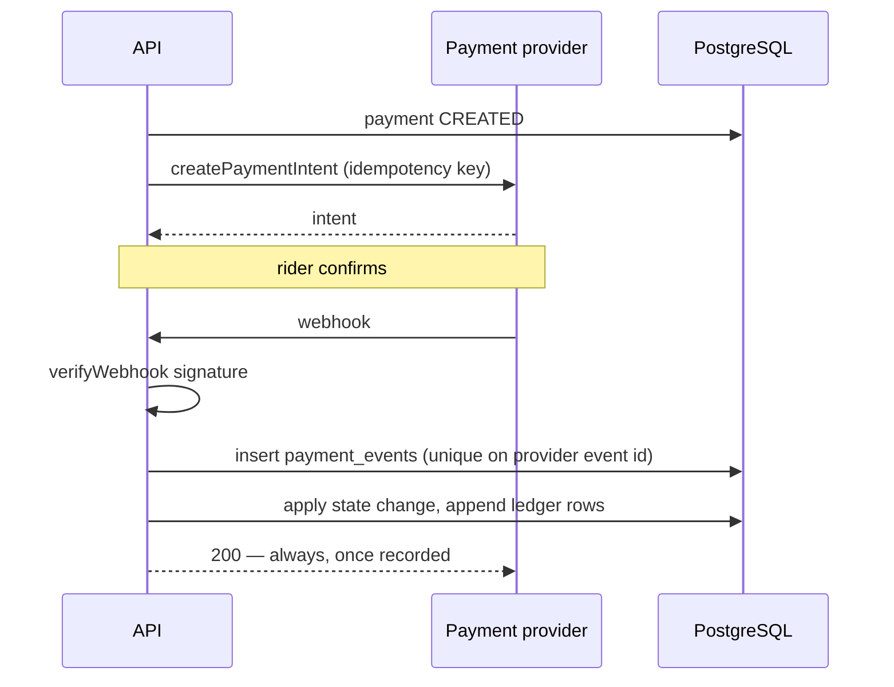
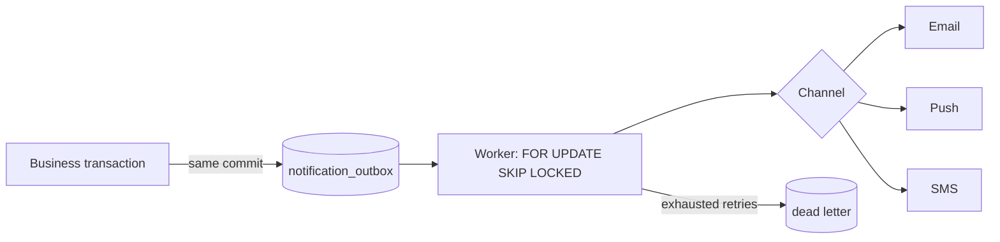

# RideX B2C — High-Level Design

System-level view: what the pieces are, how a request moves through them, and where each one fails.
Class- and table-level detail is in [25-LLD-Low-Level-Design.md](25-LLD-Low-Level-Design.md).

Sections marked **built** exist in the repository today. Everything else is design intent, ordered
by [15-Phase-Plan.md](15-Phase-Plan.md) and tracked in [21-Gap-Tasks.md](21-Gap-Tasks.md). The
distinction is kept explicit on purpose: a design document that reads as though it were already
implemented is how a team ends up building the same thing twice.

---

## 1. Context



Three human actors, one platform, six external dependencies. Every external dependency sits behind
an interface owned by the platform — `MapsProvider` is the built example — so a provider swap is an
`infrastructure` change and nothing above it moves.

The webhook arrow pointing back at the platform is the one that costs teams money. It is an
untrusted inbound call that carries financial truth, and it is designed for in §7.

---

## 2. Containers



**One deployable artifact.** The workers are the same jar with a scheduler enabled, not a second
service. [19-Technology-Stack.md](19-Technology-Stack.md) forbids Kafka, Kubernetes and
microservices at this stage, and that rule holds here: a modular monolith with clean module seams
can be split later, whereas six services built before there is a product cost a team its first year.

**API nodes are stateless.** No HTTP session, no in-memory ride state, no sticky routing. Everything
a request needs is in the token, PostgreSQL or Redis. That is what makes horizontal scaling a
configuration change.

### What lives where

| Store | Holds | Loses on restart |
|---|---|---|
| PostgreSQL | Users, profiles, rides, trips, payments, ledger, outbox, audit — all business truth | Nothing. Source of truth |
| Redis | Driver live positions, geo index, offer locks, rate-limit counters, route cache, WebSocket fan-out | Everything, by design |
| Object storage | KYC documents, profile images, rendered invoices | Nothing |

The dividing rule: **if losing it loses money, a legal obligation, or a business promise, it goes in
PostgreSQL.** A driver's position four seconds ago is none of those. A payment event is all three.

---

## 3. Backend module map



Dependencies point inward. `application` depends on interfaces the domain owns; `infrastructure`
implements them. The domain imports no Spring MVC, no payment SDK, no mail SDK.

Planned modules, in build order: `auth` · `user` · `rider` · `driver` · `vehicle` · `location` ·
`pricing` · `trip` · `dispatch` · `payment` · `payout` · `promotion` · `wallet` · `notification` ·
`invoice` · `support` · `admin` · `audit` · `media`.

Two seams matter more than the rest, because they are where a ride-hailing codebase usually rots:

- **Dispatch must not know about pricing.** It answers "which driver", not "how much". A dispatch
  service that reads a fare table has already merged two problems that scale differently and change
  for different reasons.
- **Trip must not know about payment providers.** It emits a completed trip; payment reacts. Making
  trip completion wait on Stripe means a provider outage strands riders in a moving car.

---

## 4. Authentication and authorization — **built**

```mermaid
sequenceDiagram
    participant C as Client
    participant API
    participant DB as PostgreSQL

    C->>API: POST /auth/login {email, password, app}
    API->>DB: find user, verify BCrypt hash
    API->>API: status must be ACTIVE
    API->>API: granted = app.grantableFrom(user.roles)
    API->>DB: insert refresh_tokens row (hashed, per device)
    API-->>C: access token (1h) + refresh token (7d)

    C->>API: any request, Bearer access token
    API->>API: verify signature, reject tokenType != access
    API->>API: authorize on roles in the token

    C->>API: POST /auth/refresh
    API->>DB: look up by token hash; must be live
    API->>API: re-derive roles from the account
    API->>DB: rotate hash in place on the same row
    API-->>C: new access + refresh pair
```

Three decisions, all deliberate:

**App-scoped tokens.** The client states its surface; the server intersects that surface's permitted
roles with the account's actual roles and grants only the intersection. Least privilege — a stolen
rider token cannot reach driver routes. It is not the security boundary: endpoints still authorize
on role, so a forged `app` claim grants nothing alone.

**One account, many roles.** A person who drives and rides is one login. Only `RIDER` and `DRIVER`
are self-registerable.

**Rotation with re-derivation.** Roles are read from the account at every refresh, so a revoked role
stops applying within one access-token lifetime instead of surviving the token's full week.

Default-deny on the filter chain: six public auth routes and `/actuator/health`, everything else
authenticated. Permission-based authorization per [14-Security.md](14-Security.md), with roles as the
UI representation — the console already models it that way.

---

## 5. Location and dispatch

The highest-write, lowest-durability path in the system, and the one most often designed wrong.



A position ping every four seconds from every on-duty driver is a write rate PostgreSQL should never
see. Live positions go to a Redis geo index; only trip-scoped history is persisted, and even that is
simplified before storage (§8).



**Two drivers must never win the same offer.** The claim is a single conditional update —
`UPDATE ride_offers SET status='ACCEPTED' WHERE id=? AND status='OFFERED'` — and a zero row count is
the loss. One statement, one row, the database as the arbiter. Application-level checking, a
distributed lock or an in-memory set are all ways of being wrong under concurrency.

**Timeouts are server-issued.** The countdown a driver sees is rendered from an expiry the server
set. A client-side timer means a driver with a slow clock or a paused app can accept a dead offer.

Target: a dispatch decision within 2 seconds ([06-Non-Functional-Requirements.md](06-Non-Functional-Requirements.md)).

---

## 6. Trip lifecycle



Per [11-State-Machines.md](11-State-Machines.md). Three rules:

1. **The machine lives in one place** — on the aggregate, as `DriverProfile.transitionTo` already
   does for onboarding. No caller invents a transition.
2. **Every transition is one transaction** that writes the new state, appends to
   `trip_status_history`, and enqueues outbox rows. Either all of it happened or none of it did.
3. **The driver's phone displays the fare, it never decides it.** Same for trip state: a client
   sends an intent, the server decides whether it is legal.

Completion emits a domain event. Payment, earnings, invoice and notifications all react to it —
none of them run inside the completing transaction.

---

## 7. Money

Five distinct financial domains, never one mutable balance field
([13-Payment-Architecture.md](13-Payment-Architecture.md)): rider payment, driver earnings, driver
payout, platform fees, refunds and adjustments.



Four rules that are not negotiable:

- **Idempotency key on every outbound command.** Mobile networks retry. Without a key, a retry is a
  second charge.
- **Webhook dedup on the provider's event ID**, enforced by a unique constraint, not an `if` check.
  Providers deliver the same event more than once by design.
- **Append-only ledger.** Balances are derived, never overwritten. A refund appends; it does not
  edit the payment. An invoice correction is a credit note, never an edit.
- **Money is `BIGINT` minor units with an explicit currency per row.** Never a float, never an
  implicit currency. This is cheap now and brutal to retrofit.

A rider wallet, promotional credit and driver payouts are all entries in the same ledger with
different account types — not three balance columns in three tables.

---

## 8. Real-time and geometry

One WebSocket/STOMP connection per client for ride status, driver position and offers. Redis pub/sub
fans out across API nodes so any node can push to any connection. Push notification is the fallback
when the socket is down — the same event, two transports, deduplicated at the client.

Two different polylines, routinely confused:

| | Planned route | Actual path |
|---|---|---|
| Source | Maps provider at estimate time | Driver position pings |
| Stored | Encoded string on the ride request | Simplified once, at trip completion |
| Purpose | ETA, fare, the line drawn before pickup | Receipts, disputes, route-deviation review |

Cache the planned route in Redis keyed on rounded coordinates — maps providers bill per call and
identical routes are requested constantly. Simplify the actual path (Ramer–Douglas–Peucker) before
persisting: keeping every 4-second ping forever costs storage for a resolution nobody reads.

PostGIS earns its place when service-area polygons arrive. Until then Redis geo commands plus a
bounding box cover driver search.

---

## 9. Asynchronous work



**The outbox row is written in the same transaction as the business change.** That is the whole
point: a trip that completed always has its notification queued, and a rolled-back trip never
notifies anyone. Publishing to an in-memory event bus instead means a process restart silently loses
a business communication ([12-Notification-Matrix.md](12-Notification-Matrix.md)).

One outbox mechanism, reused by notifications, invoice rendering, payout initiation and webhook
follow-up. Not four.

Workers claim batches with `FOR UPDATE SKIP LOCKED` so several API nodes can run one safely. Retries
use exponential backoff; exhausted rows land in a dead-letter table with the failure, because a
silently dropped payout notification is an operational incident nobody hears about.

---

## 10. Failure modes

The design is only as good as its answer to each of these.

| Failure | Behaviour |
|---|---|
| Maps provider down | Estimates fail closed with a clear error. Trips already running continue — a running trip must never depend on a geocoder |
| Payment provider down | Trip still completes. Payment retries; the trip is marked unpaid and settled later. Never strand a rider in a car over a gateway timeout |
| Webhook delivered twice | Unique constraint on the provider event ID rejects the duplicate; the endpoint still returns 200 |
| Webhook never delivered | Reconciliation job polls provider state for pending payments. Never rely solely on inbound delivery |
| Redis lost | Live positions and rate-limit counters are gone; drivers re-register on the next ping. No business data lost. Dispatch degrades for seconds, it does not corrupt |
| Two drivers accept one offer | Conditional update — one wins, the other gets 409 and a clear message |
| Client retries a POST | Idempotency key returns the original result rather than creating a second ride or charge |
| API node dies mid-transaction | Transaction rolls back. Stateless nodes, so the client retries against another |
| Mail provider down | Outbox rows accumulate and drain when it returns. Nothing blocks on it |

---

## 11. Scaling path

In the order the constraints actually arrive:

1. **More API nodes.** Stateless, so this is a replica count. Good for a long time.
2. **Read replicas** for admin reporting and trip history. Ops queries must never contend with
   dispatch.
3. **Redis for everything hot** — positions, offer state, rate limits, route cache. Already the
   design.
4. **Partition the high-volume tables** — `trip_locations`, `payment_events`, `audit_logs` — by time.
5. **Split a module into a service only when a real boundary hurts**, and dispatch is the first
   candidate because its load profile is unlike everything else. Not before.

Steps 1–4 carry a platform a long way. Reaching for step 5 first is the most expensive
architectural mistake available here, and [19-Technology-Stack.md](19-Technology-Stack.md) rules it
out on purpose.

---

## 12. Cross-cutting

| Concern | Approach |
|---|---|
| Security | Default-deny routes, ownership checked on every client-supplied ID, TLS everywhere, secrets from the environment, rate limits on auth and OTP ([14](14-Security.md)) |
| Observability | Correlation ID per request through logs and outbound calls, structured JSON logs, Micrometer metrics, alerts on payment, dispatch and notification failure ([06](06-Non-Functional-Requirements.md)) |
| Audit | Every admin mutation writes actor, action, target, before/after, IP and reason. Written by an interceptor, never left to each endpoint to remember |
| API contract | OpenAPI generated from the code; clients generate their types from it. Three hand-written client type sets will drift within a release |
| Migrations | Expand → migrate → contract. No destructive change in the same release as the code that stops using a column |
| Privacy | Account deletion anonymizes. Financial and audit rows are never cascade-deleted |
| Configuration | Environment variables only. Nothing secret in a committed file |

---

## 13. Decisions to record before building

Each of these is a fork that is expensive to reverse, and each deserves an entry in
[20-ADRs.md](20-ADRs.md) before code is written — not after.

1. **Shuttle modelling.** Separate `shuttle_*` tables, or one trip supertype with two subtypes?
   Route-based shuttle is seat inventory on a schedule; on-demand is dispatch. Adding a `type`
   column to `trips` and branching everywhere is the option that ruins the codebase.
2. **Money representation.** Minor units and currency per row — confirm before the first payment
   table exists.
3. **Wallet as ledger accounts** versus a separate wallet subsystem.
4. **Scheduled rides** as a first-class workflow with assignment windows, or a future timestamp on a
   ride request. [17-RideX-Differentiators.md](17-RideX-Differentiators.md) argues the former.
5. **Push transport** — FCM for both platforms, or platform-native each.
6. **Service-area representation** — PostGIS polygons or bounding boxes with an application check.
