# RideX Runtime Flow

*Developer onboarding · debugging reference*

What the RideX backend actually does at runtime, traced from the source: startup, every request path, background work, and where each step lives in the code so you can open the file and follow along.

- **Stack** Spring Boot 4.1.0 · Java 21 · PostgreSQL (Supabase pooler) · Redis · Render
- **Traced at** commit `65eb125`, 26 Sep 2026
- **Scope** `ridex-backend`, 396 main classes

> **How to read the references**
>
> Unless a path starts with `src/` or names a root file, it is relative to `ridex-backend/src/main/java/com/ridex/`. `Class#method` is the method to open; `:123` is the line at the traced commit. Migrations are in `src/main/resources/db/migration/`.
>
> - *[app]* written in this repo
> - *[framework]* Spring/Hibernate/JVM behaviour, not RideX code
> - *[not verified]* inferred from code, not observed at runtime
> - **[defect]** a bug or risk found while tracing
>
> No secrets appear here. Environment variables are named, never valued.

## 1. System runtime overview

RideX is one Spring Boot process (a modular monolith). Each feature is a package under `com.ridex`: `auth`, `ride`, `dispatch`, `trip`, `payment`, `shuttle` and so on. They share one PostgreSQL schema and one Redis. There are no message brokers and no other services. All asynchronous work happens in one of three ways:

- **Five `@Scheduled` jobs** on Spring's default single scheduler thread (the dispatch sweep, the outbox, shuttle hold expiry, document expiry, and refresh-token cleanup).
- **Two manual `TransactionSynchronization.afterCommit` hooks**: `dispatch/DispatchTrigger#afterCommit` and `shuttle/ShuttleRunService#publish`.
- **STOMP server push** through Spring's in-memory simple broker.

There is **no** `@Async`, no `@EventListener`, no `ApplicationEventPublisher`, no Kafka or RabbitMQ, and no cache abstraction.

**Diagram: Runtime topology**

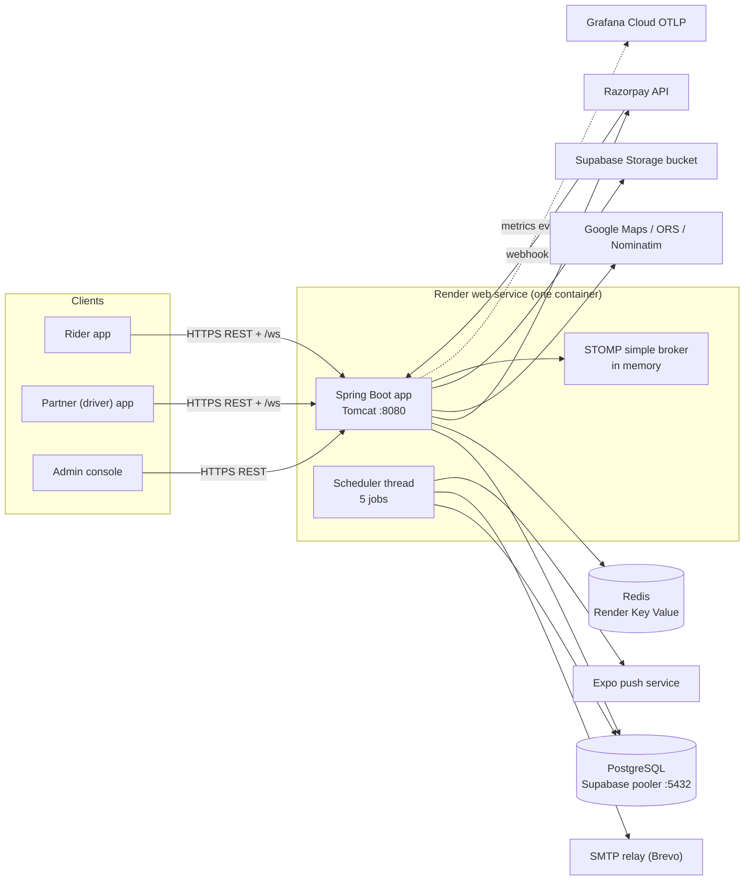
```mermaid
flowchart LR
  subgraph Clients
    RA["Rider app"]
    DA["Partner (driver) app"]
    AW["Admin console"]
  end
  subgraph Render["Render web service (one container)"]
    APP["Spring Boot app<br/>Tomcat :8080"]
    SCH["Scheduler thread<br/>5 jobs"]
    BRK["STOMP simple broker<br/>in memory"]
  end
  PG[("PostgreSQL<br/>Supabase pooler :5432")]
  RD[("Redis<br/>Render Key Value")]
  RZ["Razorpay API"]
  MP["Google Maps / ORS / Nominatim"]
  SMTP["SMTP relay (Brevo)"]
  EXPO["Expo push service"]
  SB["Supabase Storage bucket"]
  GF["Grafana Cloud OTLP"]
  RA -- "HTTPS REST + /ws" --> APP
  DA -- "HTTPS REST + /ws" --> APP
  AW -- "HTTPS REST" --> APP
  APP --> PG
  APP --> RD
  APP --> RZ
  APP --> MP
  APP --> SB
  SCH --> PG
  SCH --> SMTP
  SCH --> EXPO
  RZ -- "webhook" --> APP
  APP --> BRK
  APP -. "metrics every 60s" .-> GF
```

| Concern | Where it lives | Runs |
|---|---|---|
| HTTP API | 33 `@RestController` classes under `/api/v1/**` ([map](#22-class--component-dependency-map)) | Tomcat request threads, synchronously |
| Auth | `platform/security/*`, `auth/*` | In the filter chain, per request |
| Persistence | Spring Data JPA repositories; `NamedParameterJdbcTemplate` only in `admin/AdminSearch` and `wallet/AdminWalletQueries` | Request thread or scheduler thread |
| Hot state | Redis: driver GEO presence, rate limits, maps budget, shuttle live position | Inline, no async |
| Side effects | `notification/Notifier` writes outbox rows; `OutboxDispatcher` sends them | Scheduler thread, every 5 s |
| Realtime | `platform/realtime/*`, `StompOfferNotifier`, `ShuttleRunService#publish` | Server push only; no inbound `@MessageMapping` |

## 2. Application startup flow

The order below follows the real Render log from the TLS incident (Tomcat initialised, then Hikari, then Flyway) together with Spring Boot's documented refresh order. On Render's free instance (0.1 CPU) the context takes about 57 s to reach Hikari. On a laptop it takes about 13 s.

**Diagram: Startup sequence**

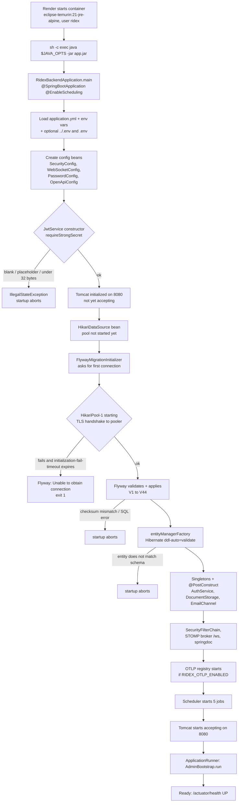
```mermaid
flowchart TD
  A["Render starts container<br/>eclipse-temurin:21-jre-alpine, user ridex"] --> B["sh -c exec java $JAVA_OPTS -jar app.jar"]
  B --> C["RidexBackendApplication.main<br/>@SpringBootApplication @EnableScheduling"]
  C --> D["Load application.yml + env vars<br/>+ optional ../.env and .env"]
  D --> E["Create config beans<br/>SecurityConfig, WebSocketConfig,<br/>PasswordConfig, OpenApiConfig"]
  E --> F{"JwtService constructor<br/>requireStrongSecret"}
  F -- "blank / placeholder / under 32 bytes" --> X1["IllegalStateException<br/>startup aborts"]
  F -- ok --> G["Tomcat initialized on 8080<br/>not yet accepting"]
  G --> H["HikariDataSource bean<br/>pool not started yet"]
  H --> I["FlywayMigrationInitializer<br/>asks for first connection"]
  I --> J{"HikariPool-1 starting<br/>TLS handshake to pooler"}
  J -- "fails and initialization-fail-timeout expires" --> X2["Flyway: Unable to obtain connection<br/>exit 1"]
  J -- ok --> K["Flyway validates + applies<br/>V1 to V44"]
  K -- "checksum mismatch / SQL error" --> X3["startup aborts"]
  K --> L["entityManagerFactory<br/>Hibernate ddl-auto=validate"]
  L -- "entity does not match schema" --> X4["startup aborts"]
  L --> M["Singletons + @PostConstruct<br/>AuthService, DocumentStorage, EmailChannel"]
  M --> N["SecurityFilterChain,<br/>STOMP broker /ws, springdoc"]
  N --> O["OTLP registry starts<br/>if RIDEX_OTLP_ENABLED"]
  O --> P["Scheduler starts 5 jobs"]
  P --> Q["Tomcat starts accepting on 8080"]
  Q --> R["ApplicationRunner: AdminBootstrap.run"]
  R --> S["Ready: /actuator/health UP"]
```

### Step by step

1. **Container and JVM.** The Dockerfile's runtime stage runs `exec java $JAVA_OPTS -jar app.jar` as the non-root user `ridex`. `JAVA_OPTS` sets `-Duser.timezone=Asia/Kolkata`, because Hibernate reads shuttle schedule times in the JVM zone. Render's own `JAVA_OPTS` variable, if set, replaces the Dockerfile default entirely. *[framework]* 
   Code: `ridex-backend/Dockerfile (ENV JAVA_OPTS, ENTRYPOINT)`
2. **Main class.** `@SpringBootApplication` plus `@EnableScheduling`. There is no `@EnableAsync` and no `@ConfigurationPropertiesScan`; the two `@ConfigurationProperties` classes are also `@Component`s. *[app]* 
   Code: `RidexBackendApplication.java:7-8`
3. **Configuration loading.** `application.yml`, then environment variables (Spring's relaxed binding, so `SPRING_DATASOURCE_URL` overrides `spring.datasource.url`), then `spring.config.import: optional:file:../.env[.properties],optional:file:.env[.properties]`. A container has no `.env`, and real environment variables always win over it. 
   Code: `src/main/resources/application.yml`
4. **Fail-fast secret check.** The `JwtService` constructor calls `requireStrongSecret`. If `RIDEX_JWT_SECRET` is blank, equals the old repository placeholder, or is under 32 bytes, it throws and the context never starts. This is intentional. *[app]* 
   Code: `platform/security/JwtService.java (constructor, ~:53)`
5. **Tomcat is created early but not started.** The "Tomcat initialized with port 8080" log line comes from `onRefresh`, which runs before the singleton beans are built. Requests are accepted only at the end of the refresh. *[framework]*
6. **First database connection comes from Flyway.** Boot orders `flywayInitializer` before `entityManagerFactory`. The `HikariDataSource` starts its pool on the first `getConnection()`. By default Hikari tries once and gives up (`initializationFailTimeout=1`). On Render the environment sets `SPRING_DATASOURCE_HIKARI_INITIALIZATIONFAILTIMEOUT=60000`, so a cold first TLS handshake that the Supabase pooler drops is retried on a warm JVM. That setting is not in the repo. *[framework]* 
   Code: `stack: FlywayMigrationInitializer#afterPropertiesSet → HikariPool#checkFailFast → org.postgresql.ssl.MakeSSL#convert`
7. **Flyway applies migrations V1 to V44** from `classpath:db/migration`, in version order, each in its own transaction (PostgreSQL has transactional DDL). A migration that already ran is checksum-validated and never re-run. V23 needs the `btree_gist` extension, which it creates.
8. **Hibernate validates the schema.** `ddl-auto: validate` means Hibernate never changes tables; it only checks that the entities match the tables Flyway created. Other settings: `open-in-view: false` (no lazy loading in views, so the connection is released when the service returns) and `hibernate.jdbc.time_zone: UTC`.
9. **`@PostConstruct` hooks.** *[app]*
   - `AuthService#generateDecoyHash` BCrypt-hashes a random value. Login compares against it when the email doesn't exist, so the response time doesn't reveal whether an account exists.
   - `DocumentStorage#announceBackend` builds a `RestClient` for the Supabase bucket when `RIDEX_BUCKET_URL` and `RIDEX_BUCKET_KEY` are set. Otherwise it logs a WARN that documents are going to local disk.
   - `EmailChannel#warnIfEchoing` logs a WARN when `RIDEX_MAIL_ECHO=true`, because verification codes then go to the log.
10. **Web layer.**
    - `SecurityConfig#securityFilterChain` builds the filter chain (see [section 4](#4-security--authentication-runtime)).
    - `WebSocketConfig` registers STOMP on `/ws` with a simple broker on `/topic` and `/queue`.
    - `OpenApiConfig#ridexOpenApi` feeds springdoc at `/v3/api-docs` and `/swagger-ui.html`.
    - `admin/AuditInterceptor` (an `@Aspect`) wraps every `@Audited` method.
11. **Redis is not contacted at startup.** Lettuce connects lazily on the first command, and `management.health.redis.enabled: false` keeps Redis out of the health check. So a Redis outage never blocks a deploy. It shows up on the first rate-limited, dispatch or location call instead. *[not verified]*
12. **Metrics export.** When `RIDEX_OTLP_ENABLED=true`, the log shows `Publishing metrics for OtlpMeterRegistry every 1m ...`. The exporter needs both `micrometer-registry-otlp` and `spring-boot-opentelemetry` on the classpath (commit `65eb125`). Without the second one, Boot silently skips it.
13. **Scheduler.** After refresh, `@EnableScheduling` starts the five jobs ([section 15](#15-scheduled--background-jobs)). There is no `spring.task.scheduling.pool.size`, so they share Boot's default single thread. *[framework]*
14. **Tomcat starts accepting, then `ApplicationRunner`s run.** `auth/AdminBootstrap#run` (`@Transactional`) creates the first `SUPER_ADMIN` from `RIDEX_BOOTSTRAP_ADMIN_EMAIL` and `RIDEX_BOOTSTRAP_ADMIN_PASSWORD`. It does this only when both are set and no SUPER_ADMIN exists yet. 
    Code: `auth/AdminBootstrap.java:41-62`
15. **Ready.** `/actuator/health` returns `{"status":"UP"}`. The Docker `HEALTHCHECK` polls it every 30 s after a 60 s start period. Render runs its own port scan too ("No open ports detected, continuing to scan..." is normal while the context is still starting).

## 3. HTTP request lifecycle

Every REST call takes the same path. Security runs as a **servlet filter** (`FilterChainProxy`) *before* `DispatcherServlet`. Role checks from `@PreAuthorize` run later, around the controller method. That order explains two behaviours:

- A missing token is rejected with 401 before any controller code runs.
- A wrong role gets 403 only after the request body has been bound and validated. So a rider sending an invalid body to a driver endpoint gets a 400, not a 403. *[framework]* *[not verified]*

**Diagram: Generic authenticated request (example: POST /api/v1/rides)**

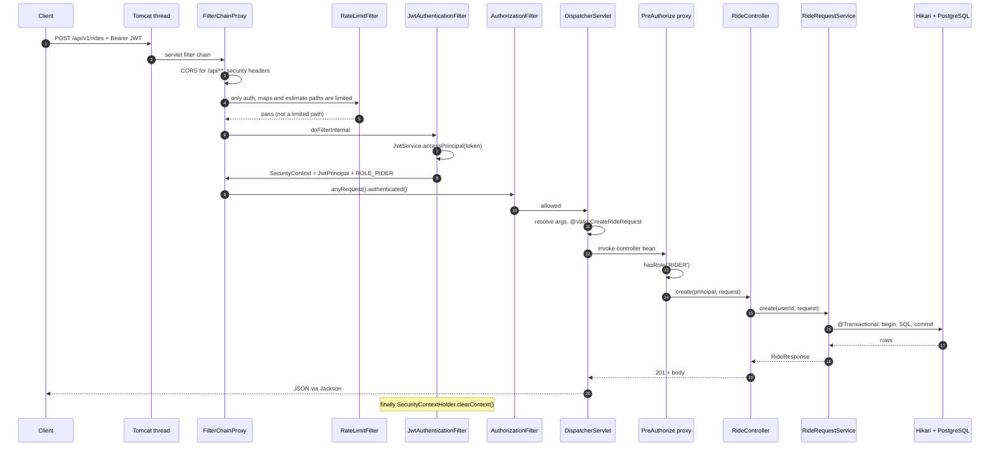
```mermaid
sequenceDiagram
  autonumber
  participant C as Client
  participant T as Tomcat thread
  participant F as FilterChainProxy
  participant RL as RateLimitFilter
  participant J as JwtAuthenticationFilter
  participant AZ as AuthorizationFilter
  participant DS as DispatcherServlet
  participant PA as PreAuthorize proxy
  participant CT as RideController
  participant SV as RideRequestService
  participant DB as Hikari + PostgreSQL
  C->>T: POST /api/v1/rides + Bearer JWT
  T->>F: servlet filter chain
  F->>F: CORS for /api/**, security headers
  F->>RL: only auth, maps and estimate paths are limited
  RL-->>F: pass (not a limited path)
  F->>J: doFilterInternal
  J->>J: JwtService.accessPrincipal(token)
  J->>F: SecurityContext = JwtPrincipal + ROLE_RIDER
  F->>AZ: anyRequest().authenticated()
  AZ->>DS: allowed
  DS->>DS: resolve args, @Valid CreateRideRequest
  DS->>PA: invoke controller bean
  PA->>PA: hasRole('RIDER')
  PA->>CT: create(principal, request)
  CT->>SV: create(userId, request)
  SV->>DB: @Transactional: begin, SQL, commit
  DB-->>SV: rows
  SV-->>CT: RideResponse
  CT-->>DS: 201 + body
  DS-->>C: JSON via Jackson
  Note over J: finally SecurityContextHolder.clearContext()
```

| Stage | Real component | What happens and why |
|---|---|---|
| Edge | Render proxy | Terminates HTTPS and forwards HTTP to port 8080. Adds `X-Forwarded-For`, which `RateLimitFilter` uses as the client IP (first hop). |
| Connector | Tomcat 11.0.x *[framework]* | One worker thread per request, from accept until the response is written. |
| CORS | `SecurityConfig#corsConfigurationSource` :108 | Exact origins from `RIDEX_CORS_ALLOWED_ORIGINS`, only for `/api/**`. Allowed headers: `Authorization`, `Content-Type`, `Idempotency-Key`. Credentials off. |
| Headers | `SecurityConfig#securityFilterChain` :65 | HSTS (1 year, preload), `X-Frame-Options: DENY`, CSP `default-src 'none'`, `Referrer-Policy: no-referrer`. CSRF is disabled because the API is stateless and uses bearer tokens. |
| Rate limit | `platform/ratelimit/RateLimitFilter` | Registered first, so it runs before JWT parsing and brute force costs no crypto. Limit: 30 requests per minute per IP per URI, on auth, `/maps/` and `/rides/estimate`. Answers 429 with `Retry-After`. |
| Authentication | `platform/security/JwtAuthenticationFilter#doFilterInternal` | Sets a `JwtPrincipal` from the Bearer token, or passes through anonymously. A bad token gets 401 immediately. No database read. |
| Authorization (URL) | `authorizeHttpRequests` in `SecurityConfig` | Public: `PUBLIC_ENDPOINTS`, `/actuator/health`, `/ws/**`, swagger. Everything else needs authentication, otherwise `ProblemAuthenticationEntryPoint` returns 401 problem+json. |
| Binding + validation | DispatcherServlet, Jakarta Validation *[framework]* | `@Valid` on request DTOs. A failure throws `MethodArgumentNotValidException`, which becomes 400 with a per-field `errors` map. |
| Authorization (method) | `@EnableMethodSecurity`, `@PreAuthorize` (33 uses, mostly class-level) | Role gate per controller. A denial becomes `AccessDeniedException`, then 403 through `GlobalExceptionHandler#handleAccessDenied`. |
| Controller | e.g. `ride/RideController#create` | Thin. Reads the user id from `@AuthenticationPrincipal JwtPrincipal` (96 uses) and delegates. |
| Service | e.g. `ride/RideRequestService#create` | Holds `@Transactional`. All business rules live here. |
| Response | Jackson 3 (`tools.jackson`) *[framework]* | DTO records serialised to JSON. Errors are RFC 7807 `ProblemDetail`. |

## 4. Security & authentication runtime

### Login

**Diagram: POST /api/v1/auth/login**

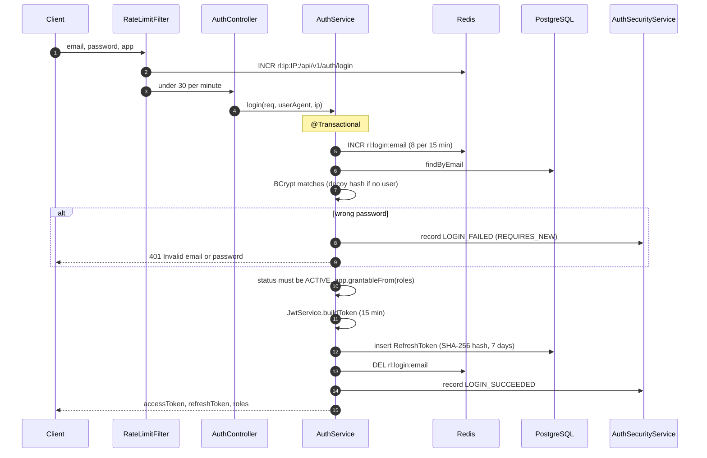
```mermaid
sequenceDiagram
  autonumber
  participant C as Client
  participant RL as RateLimitFilter
  participant AC as AuthController
  participant AS as AuthService
  participant R as Redis
  participant DB as PostgreSQL
  participant SEC as AuthSecurityService
  C->>RL: email, password, app
  RL->>R: INCR rl:ip:IP:/api/v1/auth/login
  RL->>AC: under 30 per minute
  AC->>AS: login(req, userAgent, ip)
  Note over AS: @Transactional
  AS->>R: INCR rl:login:email (8 per 15 min)
  AS->>DB: findByEmail
  AS->>AS: BCrypt matches (decoy hash if no user)
  alt wrong password
    AS->>SEC: record LOGIN_FAILED (REQUIRES_NEW)
    AS-->>C: 401 Invalid email or password
  end
  AS->>AS: status must be ACTIVE, app.grantableFrom(roles)
  AS->>AS: JwtService.buildToken (15 min)
  AS->>DB: insert RefreshToken (SHA-256 hash, 7 days)
  AS->>R: DEL rl:login:email
  AS->>SEC: record LOGIN_SUCCEEDED
  AS-->>C: accessToken, refreshToken, roles
```

- **Access token** (`platform/security/JwtService#buildToken` ~:106). HMAC-SHA via jjwt, keyed with `RIDEX_JWT_SECRET`.
  - Claims: `sub`=userId, `email`, `roles` (sorted), `app` (RIDER / DRIVER / ADMIN), `tokenType`=`"access"`, `iat`, `exp`.
  - Lifetime: `app.jwt.access-expiration-ms` = 900000 (15 minutes).
- **Roles are scoped to the app.** `auth/domain/AppContext#grantableFrom` intersects the user's roles with the surface they logged into (RIDER, DRIVER, or ADMIN = SUPPORT, OPS_ADMIN and SUPER_ADMIN). A rider token therefore never carries admin roles, even for a user who has both.
- **Refresh token**. Not a JWT: 32 random bytes (base64url) stored only as a SHA-256 hash in `refresh_tokens`, one row per login or device.
  - Lifetime: **7 days, hard-coded** as `REFRESH_TOKEN_VALIDITY`. The yml key `app.jwt.refresh-expiration-ms` is not read anywhere.
  - `AuthService#refresh` :259 rotates the token in place and keeps the previous hash. If an already-rotated token is presented again, `AuthSecurityService#respondToTokenReuse` treats it as theft and revokes every session of that user.
- **Auth events** go to `auth_events` through `AuthSecurityService#record`, which uses `REQUIRES_NEW`. A failed login is recorded even though the login's own transaction rolls back.

### Authenticated request

1. `JwtAuthenticationFilter#doFilterInternal`:
   - no `Authorization` header, or not `Bearer `: continues anonymously;
   - `Bearer ` followed by an empty token: 401 "Missing JWT token.";
   - any parse failure: clears the context, then 401 "Invalid or expired JWT token.". 
   Code: `platform/security/JwtAuthenticationFilter.java ~:28-62`
2. `JwtService#accessPrincipal` ~:78 verifies the signature and expiry. It rejects the token unless `tokenType=="access"` and `sub`, `email`, `app` and a non-empty `roles` are all present. An unknown role name fails the parse.
3. `JwtPrincipal#toAuthentication` gives a `UsernamePasswordAuthenticationToken` with `ROLE_<role>` authorities. `getName()` returns the **user id**, and that also becomes the STOMP user name. 
   Code: `platform/security/JwtPrincipal.java`
4. After the chain returns, a `finally` block clears `SecurityContextHolder`, so a pooled Tomcat thread never keeps the previous user.

> **Tracing notes**
>
> - `JwtAuthenticationFilter` is a `@Component` with no `FilterRegistrationBean`. Boot probably also registers it as a plain servlet filter. `OncePerRequestFilter` stops it from running twice, but it runs once outside the security chain. *[not verified]*
> - `admin/AdminPayoutController:29` requires `hasAnyRole('FINANCE','SUPER_ADMIN')`, but `UserRole` has no FINANCE value. In practice only SUPER_ADMIN can run payouts. **[defect]**
> - Only `/actuator/health` is exposed and permitted. Boot's default exposure is health only. No other actuator endpoint is reachable.

### Other auth flows

| Endpoint | Method | Runtime behaviour |
|---|---|---|
| `POST /auth/register` → 202 | `AuthService#register` :94 | Always BCrypt-hashes the password, so timing is equal. A new email creates a User with status PENDING, a rider or driver profile, and a 6-digit OTP (BCrypt-hashed, 10 min, max 5 attempts) sent as an outbox EMAIL `VERIFY_ACCOUNT`. An existing email gets an `ACCOUNT_EXISTS` email, or a fresh OTP if the account is still PENDING. The caller always sees 202. |
| `POST /auth/verify` | `#verifyEmail` :346 | Consumes the OTP, sets the account ACTIVE, and queues a `WELCOME` email. |
| `POST /auth/forgot-password` | `#requestPasswordReset` :363 | Always 202. Sends an OTP `RESET_PASSWORD` only if the user exists. |
| `POST /auth/reset-password` | `#resetPassword` :374 | Consumes the OTP, sets the new hash, revokes all refresh tokens and resets the login rate limit. |
| `POST /auth/logout`, `DELETE /auth/sessions/{id}` | `#logout`, `#revokeSession` | Revoke only the caller's own row. The access JWT stays valid until it expires (15 min); there is no revocation list. |

## 5. Booking runtime flow

A rider books in two calls. First they **estimate**, which quotes every active ride type and saves one `FareEstimate` per type, valid 5 minutes. Then they **create** the ride by passing the chosen `estimateId`. The estimate is the idempotency key: `uk_ride_requests_estimate UNIQUE(fare_estimate_id)` (V7) allows one ride per estimate.

**Diagram: Estimate, then request**

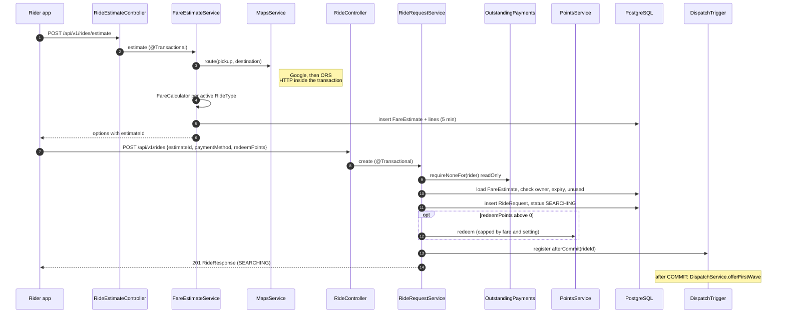
```mermaid
sequenceDiagram
  autonumber
  participant R as Rider app
  participant EC as RideEstimateController
  participant FE as FareEstimateService
  participant MS as MapsService
  participant RC as RideController
  participant RS as RideRequestService
  participant OP as OutstandingPayments
  participant PS as PointsService
  participant DB as PostgreSQL
  participant DT as DispatchTrigger
  R->>EC: POST /api/v1/rides/estimate
  EC->>FE: estimate (@Transactional)
  FE->>MS: route(pickup, destination)
  Note right of MS: Google, then ORS<br/>HTTP inside the transaction
  FE->>FE: FareCalculator per active RideType
  FE->>DB: insert FareEstimate + lines (5 min)
  FE-->>R: options with estimateId
  R->>RC: POST /api/v1/rides {estimateId, paymentMethod, redeemPoints}
  RC->>RS: create (@Transactional)
  RS->>OP: requireNoneFor(rider) readOnly
  RS->>DB: load FareEstimate, check owner, expiry, unused
  RS->>DB: insert RideRequest, status SEARCHING
  opt redeemPoints above 0
    RS->>PS: redeem (capped by fare and setting)
  end
  RS->>DT: register afterCommit(rideId)
  RS-->>R: 201 RideResponse (SEARCHING)
  Note over DT: after COMMIT: DispatchService.offerFirstWave
```

1. `pricing/RideEstimateController#estimate` handles `POST /api/v1/rides/estimate` (RIDER, and rate-limited). The `EstimateRequest` fields are `@NotNull` with latitude/longitude range checks.
2. `pricing/FareEstimateService#estimate` (:42, read-write transaction) calls `MapsService#route` once, then for each active `RideType` with a `PricingRule` in force runs `FareCalculator.calculate`. It saves `FareEstimate` plus `FareEstimateLine` rows, with `expiresAt = now + 5 min` (`QUOTE_VALIDITY` :29).
3. `ride/RideController#create` handles `POST /api/v1/rides` and returns 201. `CreateRideRequest` has `@NotBlank estimateId`, addresses of at most 255 characters, `@Min(0) redeemPoints`, and `paymentMethod` (null means CASH).
4. `ride/RideRequestService#create` :76, `@Transactional`, runs these checks and writes in order:
   - `OutstandingPayments#requireNoneFor`: 409 if an earlier ride payment is still unpaid;
   - estimate owned by this rider (else 404), not expired (else 409), not already used (else 409);
   - builds the `RideRequest` from the estimate's coordinates and fare;
   - `transitionTo(SEARCHING)`, save;
   - optionally redeems points.
5. `dispatch/DispatchTrigger#afterCommit` registers a `TransactionSynchronization`. Offers go out only after the ride row is committed, so a driver can never be offered a ride that later rolls back. If the first wave throws, it's logged and the dispatch sweep takes over.

> **What create does not do**
>
> - It has no active-ride check: a rider can hold two live rides at once.
> - It doesn't check `rider_dues`. Cancellation dues are added to the *next fare* instead ([section 10](#10-wallet--ledger-runtime-flow)).
> - No notification or outbox row is written at booking time.
> - The estimate's maps call runs inside a read-write transaction. A slow Google or ORS response (up to 5 s + 8 s) holds a DB connection that long. **[risk]**

## 6. Dispatch runtime flow

Dispatch works in **waves**. Each wave offers the ride to up to `app.dispatch.wave-size` (default 5) new drivers within `wave-radius-meters × wave` (default 3000 m × wave). Offers live 20 s. The sweep advances a ride to its next wave when it has no live offers, and gives up after 4 waves or 180 s.

**Diagram: Offer, accept, and the race between drivers**

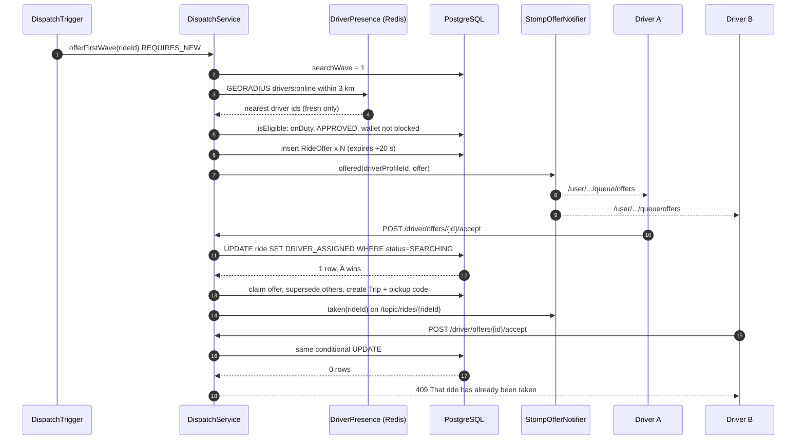
```mermaid
sequenceDiagram
  autonumber
  participant DT as DispatchTrigger
  participant DS as DispatchService
  participant P as DriverPresence (Redis)
  participant DB as PostgreSQL
  participant N as StompOfferNotifier
  participant D1 as Driver A
  participant D2 as Driver B
  DT->>DS: offerFirstWave(rideId) REQUIRES_NEW
  DS->>DB: searchWave = 1
  DS->>P: GEORADIUS drivers:online within 3 km
  P-->>DS: nearest driver ids (fresh only)
  DS->>DB: isEligible: onDuty, APPROVED, wallet not blocked
  DS->>DB: insert RideOffer x N (expires +20 s)
  DS->>N: offered(driverProfileId, offer)
  N-->>D1: /user/.../queue/offers
  N-->>D2: /user/.../queue/offers
  D1->>DS: POST /driver/offers/{id}/accept
  DS->>DB: UPDATE ride SET DRIVER_ASSIGNED WHERE status=SEARCHING
  DB-->>DS: 1 row, A wins
  DS->>DB: claim offer, supersede others, create Trip + pickup code
  DS->>N: taken(rideId) on /topic/rides/{rideId}
  D2->>DS: POST /driver/offers/{id}/accept
  DS->>DB: same conditional UPDATE
  DB-->>DS: 0 rows
  DS-->>D2: 409 That ride has already been taken
```

| Step | Code | Detail |
|---|---|---|
| Find candidates | `dispatch/DispatchService#offerRide` :73 (`REQUIRES_NEW`) | Returns if the ride is not SEARCHING. `DriverPresence#nearby` runs GEORADIUS, then drops members whose `drivers:seen:*` key has expired. Skips drivers already offered this ride. |
| Eligibility | `DispatchService#isEligible` ~:185 | On duty, onboarding APPROVED, `DriverWalletService#blockedReason == null`. Documents and vehicle are checked earlier, when the driver goes on duty (`DriverEligibility#blockedReason`). |
| Offer row | `RideOffer` → `ride_offers` | `OfferStatus`: OFFERED, ACCEPTED, REJECTED, EXPIRED, SUPERSEDED. `uk_ride_offers_ride_driver` allows one offer per ride per driver. |
| Deliver | `platform/realtime/StompOfferNotifier#offered` | `convertAndSendToUser(driverId, "/queue/offers", offer)`, sent before the `REQUIRES_NEW` transaction commits. Also readable via `GET /api/v1/driver/offers`, which is the reconnect path. |
| Accept | `DispatchService#accept` :123 | The winner is decided by `RideRequestRepository#assignDriver`, a conditional UPDATE. Then `RideOfferRepository#claim`, `#supersedeOthers`, `TripService#createForAssignedRide`, and `taken` on `/topic/rides/{rideId}`. |
| Reject | `DispatchService#reject` :164 | Conditional UPDATE to REJECTED. Silent if the offer is no longer OFFERED. |
| Next wave / give up | `dispatch/DispatchSweep#sweep` :61 | Every 5 s: bulk `expireOverdue`. Then for each SEARCHING ride with no live offers: past 180 s or wave 4, set EXPIRED and send `SEARCH_EXPIRED`; otherwise `offerRide(nextWave)`. |

### Concurrency controls

- Conditional JPQL updates, where the row count decides the winner: `assignDriver`, `claim`, `reject`, `supersedeOthers`, `expireOverdue`.
- Database backstops:
  - `uk_ride_offers_one_winner`: a partial unique index on `ride_offers(ride_request_id) WHERE status='ACCEPTED'` (V8);
  - `uk_trips_ride_request` (V10).
- `@Version` on `RideRequest` and `Trip`. No pessimistic locks and no Redis locks. The race is covered by `src/test/.../dispatch/DispatchConcurrencyTest#twoDriversAcceptingTheSameRideProduceOneWinnerAndOneConflict`.

> **Defects found in dispatch**
>
> - **Offers go to the wrong user destination.** **[defect]**
>   - `DispatchService.java:115` calls `offered(offer.getDriver().getId(), ...)`. That is the **DriverProfile id**.
>   - The STOMP user name is `JwtPrincipal#getName()`, which is the **user id**.
>   - So `/user/queue/offers` never matches the driver's session. Drivers only see offers by polling `GET /api/v1/driver/offers`. No client in the repo subscribes to `/queue/offers`.
> - **`/topic/rides/{rideId}` has no `SubscriptionGuard`.** Any authenticated socket can subscribe to any ride. **[defect]**
> - **A sweep tick is one outer transaction.** An optimistic-lock failure at the final commit would roll back every ride's changes in that tick, including `expireOverdue`. The per-ride try/catch cannot catch a commit-time failure. *[not verified]*
> - **EXPIRED keeps redeemed points.** `DispatchSweep#advance` never calls `PointsService#returnRidePoints`, so points redeemed at booking are lost when the search times out. **[defect]**

## 7. Driver location runtime flow

A driver's position lives **only in Redis**. PostgreSQL stores only the duty flag (`driver_profiles.on_duty`, `duty_changed_at`). Positions arrive over HTTP; there are no STOMP `@MessageMapping` handlers anywhere. Riders see the driver's position by polling the ride, not over a socket.

**Diagram: Location in, position out**

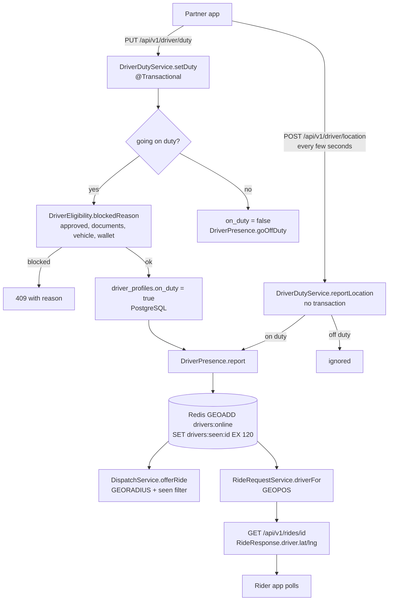
```mermaid
flowchart TD
  A["Partner app"] -->|"PUT /api/v1/driver/duty"| B["DriverDutyService.setDuty<br/>@Transactional"]
  B --> C{"going on duty?"}
  C -- yes --> D["DriverEligibility.blockedReason<br/>approved, documents, vehicle, wallet"]
  D -- blocked --> E["409 with reason"]
  D -- ok --> F["driver_profiles.on_duty = true<br/>PostgreSQL"]
  F --> G["DriverPresence.report"]
  C -- no --> H["on_duty = false<br/>DriverPresence.goOffDuty"]
  A -->|"POST /api/v1/driver/location<br/>every few seconds"| I["DriverDutyService.reportLocation<br/>no transaction"]
  I -- "off duty" --> J["ignored"]
  I -- "on duty" --> G
  G --> K[("Redis GEOADD drivers:online<br/>SET drivers:seen:id EX 120")]
  K --> L["DispatchService.offerRide<br/>GEORADIUS + seen filter"]
  K --> M["RideRequestService.driverFor<br/>GEOPOS"]
  M --> N["GET /api/v1/rides/id<br/>RideResponse.driver.lat/lng"]
  N --> O["Rider app polls"]
```

- **Why two keys.** GEO set members have no per-member TTL. `drivers:seen:{driverId}` expires after 2 minutes (`STALE_AFTER`). A driver whose app dies stops appearing in `nearby` within 2 minutes, even though the GEO member stays until they go off duty. 
  Code: `location/DriverPresence.java`
- **No fallback.** `DriverPresence` has no try/catch. When Redis is down, going on duty, location updates and ride responses throw. The first dispatch wave's error is caught in `DispatchTrigger`, and the sweep catches its own per-ride errors.
- **Consistency.** `on_duty` in PostgreSQL and membership in the Redis GEO set are written by separate systems with no shared transaction. If `setDuty` commits but the Redis write fails, the driver shows as on duty but is never found. Since `report` runs inside the transaction and throws first, the more likely outcome is a rollback. *[not verified]*
- **Shuttles differ.** Shuttle positions go through `ShuttleRunService#reportPosition` to `ShuttleLiveStore` and *are* pushed to riders on `/topic/shuttle-trips/{tripId}` ([section 16](#16-websocket--stomp-runtime-flow)).

## 8. Ride state machine

`ride/domain/RideStatus` owns the transition table. `RideRequest#transitionTo` calls `status.require(next)`, which throws `ConflictException` (409) for an illegal move. `Trip` has no status of its own; it records timestamps (`arrivedAt`, `startedAt`) and writes `TripStatusHistory` rows.

**Diagram: RideStatus as coded**

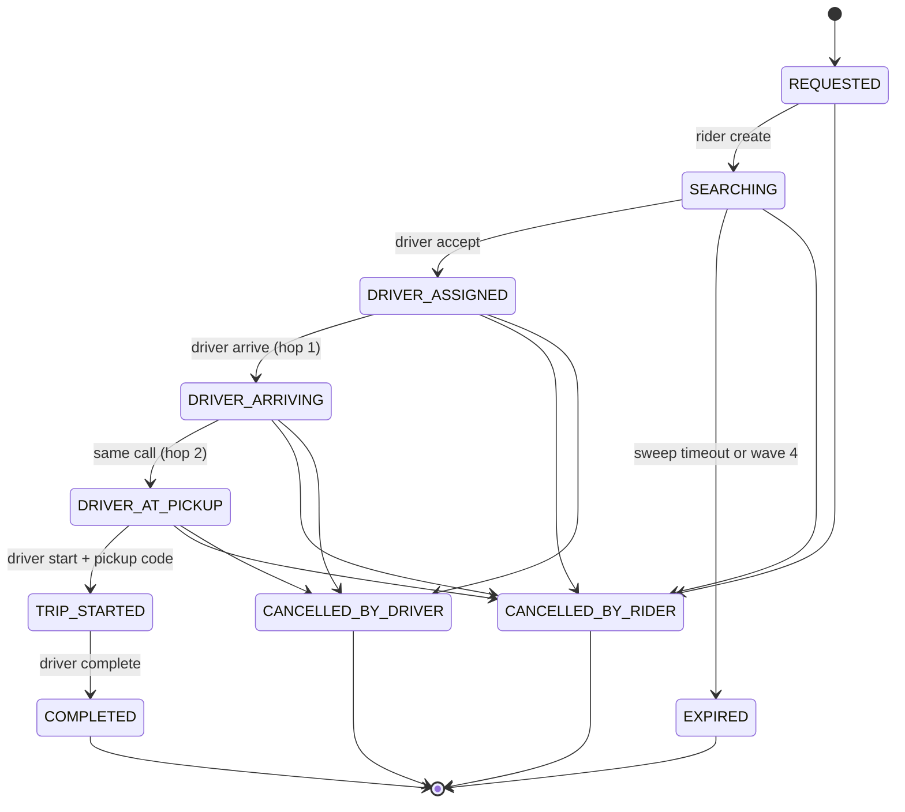
```mermaid
stateDiagram-v2
  [*] --> REQUESTED
  REQUESTED --> SEARCHING : rider create
  SEARCHING --> DRIVER_ASSIGNED : driver accept
  SEARCHING --> EXPIRED : sweep timeout or wave 4
  DRIVER_ASSIGNED --> DRIVER_ARRIVING : driver arrive (hop 1)
  DRIVER_ARRIVING --> DRIVER_AT_PICKUP : same call (hop 2)
  DRIVER_AT_PICKUP --> TRIP_STARTED : driver start + pickup code
  TRIP_STARTED --> COMPLETED : driver complete
  REQUESTED --> CANCELLED_BY_RIDER
  SEARCHING --> CANCELLED_BY_RIDER
  DRIVER_ASSIGNED --> CANCELLED_BY_RIDER
  DRIVER_ARRIVING --> CANCELLED_BY_RIDER
  DRIVER_AT_PICKUP --> CANCELLED_BY_RIDER
  DRIVER_ASSIGNED --> CANCELLED_BY_DRIVER
  DRIVER_ARRIVING --> CANCELLED_BY_DRIVER
  DRIVER_AT_PICKUP --> CANCELLED_BY_DRIVER
  COMPLETED --> [*]
  EXPIRED --> [*]
  CANCELLED_BY_RIDER --> [*]
  CANCELLED_BY_DRIVER --> [*]
```

`CANCELLED_BY_SYSTEM` is allowed from every non-terminal state in the table, but **no code path produces it**, so it's left out of the diagram.

| Transition | Who / endpoint | Guards | Side effects |
|---|---|---|---|
| → SEARCHING | Rider · `POST /api/v1/rides` · `RideRequestService#create` | Estimate valid, no unpaid payments | Points redeemed. Dispatch runs after commit. |
| SEARCHING → DRIVER_ASSIGNED | Driver · `POST /api/v1/driver/offers/{id}/accept` · `DispatchService#accept` | Offer live; conditional UPDATE wins | `Trip` created with a 6-digit pickup code (BCrypt hash plus plaintext `trips.pickup_code`, V29). History row. `OFFER_TAKEN` on `/topic/rides/{id}`. |
| SEARCHING → EXPIRED | System · `DispatchSweep#advance` | Over 180 s or past wave 4 | `SEARCH_EXPIRED` on the ride topic. No history row, no points refund. |
| → DRIVER_ARRIVING → DRIVER_AT_PICKUP | Driver · `POST /api/v1/trips/{tripId}/arrive` · `TripService#arrive` :107 | Assigned driver owns the trip | Both hops in one call; `arrivedAt` set. DRIVER_ARRIVING is never a resting state. |
| → TRIP_STARTED | Driver · `POST /api/v1/trips/{tripId}/start` · `TripService#start` :133 | `pickupCode` must match `\d{6}`; the code burns after 5 misses | A miss increments `PickupCodeAttempts#recordFailure` (`REQUIRES_NEW`, so it survives the 409 rollback). `waitingSeconds` and `startedAt` set. |
| → COMPLETED | Driver · `POST /api/v1/trips/{tripId}/complete` · `TripService#complete` :165 | Pricing rule in force | Distance bounded to 0.25×–2× the quote. Final fare uses the *current* rule. `PaymentService#settleTrip`, ledger entries, `RIDE_RECEIPT` email and push, referral progress, ride points. |
| → CANCELLED_BY_RIDER | Rider · `POST /api/v1/rides/{id}/cancel` · `RideRequestService#cancel` :179 | Not terminal; OTHER needs detail | Fee from `cancellation_policies` after a 120 s grace (V7: ₹30 assigned or arriving, ₹50 at pickup) goes to `rider_dues`; the driver gets 80%. Points returned. The driver is not notified. |
| → CANCELLED_BY_DRIVER | Driver · `POST /api/v1/driver/rides/{id}/cancel` · `#cancelAsDriver` :238 | Owns the ride; reason must be driver-side | `DriverCancellationRules#chargeFor`: unsafe is free; a rider no-show after 300 s charges the rider; within 60 s is free; otherwise the driver pays a ₹20 penalty. `RIDE_CANCELLED_BY_DRIVER` push to the rider. |

> **State machine gaps**
>
> - Cancellations and EXPIRED write no `TripStatusHistory` row.
> - Rider cancel does not check that the reason code is a rider-side reason. Only the driver cancel checks `isFor`.
> - **Cancel versus accept.** `assignDriver` is a bulk UPDATE, so it doesn't bump `@Version`. A rider cancel that loaded the ride while it was SEARCHING could overwrite DRIVER_ASSIGNED and leave an orphan Trip. *[not verified]* **[risk]**

### Other state machines

| Entity | Values | Where enforced |
|---|---|---|
| Driver onboarding | REGISTERED → PROFILE_SUBMITTED → DOCUMENTS_SUBMITTED → UNDER_REVIEW → APPROVED \| REJECTED; APPROVED → SUSPENDED → APPROVED \| REJECTED | `driver/domain/DriverOnboardingStatus#canTransitionTo`; `DriverOnboardingService` |
| Driver document | PENDING_REVIEW, APPROVED, REJECTED, EXPIRED | `DriverDocumentService#review`, `#expireLapsedDocuments` |
| Shuttle trip | SCHEDULED → RUNNING → COMPLETED, or CANCELLED (plain strings) | `ShuttleRunService#start/#finish`, `ShuttleService#cancelDeparture` |
| Shuttle booking | status BOOKED \| CANCELLED; paymentStatus PENDING \| PAID \| EXPIRED \| POINTS_CREDITED; boarding is the `boarded_at` timestamp | `ShuttleService`, `DriverShuttleService#board` |
| Payment | CREATED, REQUIRES_ACTION, PROCESSING, SUCCEEDED, FAILED, CANCELLED, REFUNDED, PARTIALLY_REFUNDED | `PaymentService`, `PaymentWebhookService#apply` |
| Outbox message | PENDING → SENT \| DEAD | `OutboxDispatcher` |

## 9. Payment runtime flow

`payment/PaymentProvider` has two implementations. `PaymentProviders#forMethod` sends `CASH` to `CashPaymentProvider` and everything else to the provider named by `app.payments.gateway` (default `RAZORPAY`). `RazorpayPaymentProvider` uses a plain `RestClient` (5 s connect, 10 s read, HTTP Basic with the key id and secret, no retries), not the Razorpay SDK.

**Diagram: Online ride payment: created at trip completion, confirmed by the client or a webhook**

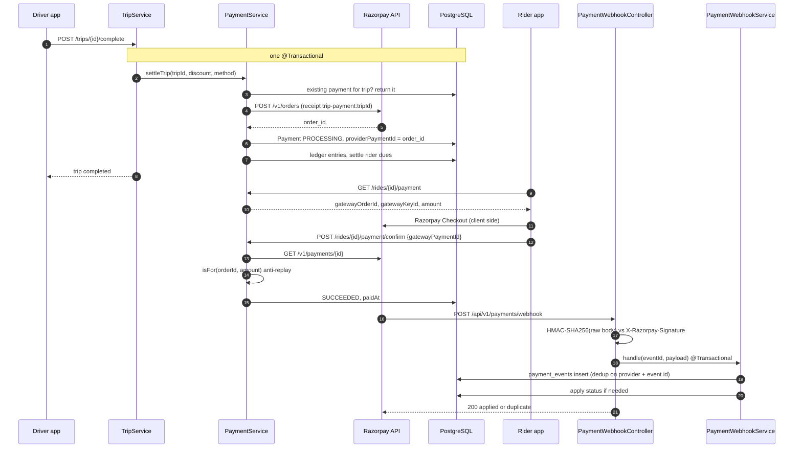
```mermaid
sequenceDiagram
  autonumber
  participant DR as Driver app
  participant TS as TripService
  participant PS as PaymentService
  participant RZ as Razorpay API
  participant DB as PostgreSQL
  participant RA as Rider app
  participant WH as PaymentWebhookController
  participant WS as PaymentWebhookService
  DR->>TS: POST /trips/{id}/complete
  Note over TS,DB: one @Transactional
  TS->>PS: settleTrip(tripId, discount, method)
  PS->>DB: existing payment for trip? return it
  PS->>RZ: POST /v1/orders (receipt trip-payment:tripId)
  RZ-->>PS: order_id
  PS->>DB: Payment PROCESSING, providerPaymentId = order_id
  PS->>DB: ledger entries, settle rider dues
  TS-->>DR: trip completed
  RA->>PS: GET /rides/{id}/payment
  PS-->>RA: gatewayOrderId, gatewayKeyId, amount
  RA->>RZ: Razorpay Checkout (client side)
  RA->>PS: POST /rides/{id}/payment/confirm {gatewayPaymentId}
  PS->>RZ: GET /v1/payments/{id}
  PS->>PS: isFor(orderId, amount) anti-replay
  PS->>DB: SUCCEEDED, paidAt
  RZ->>WH: POST /api/v1/payments/webhook
  WH->>WH: HMAC-SHA256(raw body) vs X-Razorpay-Signature
  WH->>WS: handle(eventId, payload) @Transactional
  WS->>DB: payment_events insert (dedup on provider + event id)
  WS->>DB: apply status if needed
  WH-->>RZ: 200 applied or duplicate
```

### By product

| Product | Payment created | Confirmed by | Idempotency |
|---|---|---|---|
| On-demand ride | At `TripService#complete` → `PaymentService#settleTrip` :62. Net = gross − discount + pending dues. Cash is SUCCEEDED at once; online is PROCESSING. | `POST /api/v1/rides/{id}/payment/confirm` → `#confirmForRider` :288, or the webhook | Returns the existing row per trip; `uk_payments_trip`; key `trip-payment:{tripId}` |
| Shuttle seat | At `ShuttleService#book` :192 → `ShuttlePaymentService#startShuttlePayment`. Online only; 10-minute hold. | `POST /api/v1/shuttle/bookings/{id}/payment/confirm` or the webhook → `settlePaid` | `uk_payments_shuttle_booking`; key `shuttle-payment:{bookingId}` |
| Shuttle pass | `PassService#buy` :187 → `startPassPayment`; pass is PENDING_PAYMENT | `POST /api/v1/shuttle/passes/{id}/payment/confirm` or the webhook → `activatePaid` | `uk_payments_pass`; key `pass-payment:{passId}` |
| Driver wallet top-up | `DriverWalletService#startTopUp` :69 (optional `Idempotency-Key` header) | `POST /api/v1/driver/wallet/top-ups/{id}/confirm` or a `payment.captured` webhook with no matching Payment → `settleFromWebhook` | `uk_driver_wallet_topups_idempotency`, `uk_driver_wallet_topups_payment`, ledger key `wallet-topup:{id}` |

### Webhook handling

1. `payment/PaymentWebhookController#receive` takes `POST /api/v1/payments/webhook`. It is public (`PUBLIC_ENDPOINTS` and `@PreAuthorize("permitAll()")`), because only the signature proves who sent it. The body is read as a raw `String`, so the HMAC is computed over the exact bytes Razorpay signed.
2. `RazorpayPaymentProvider#verifyWebhook` ~:145 computes HMAC-SHA256 with `RAZORPAY_WEBHOOK_SECRET` and compares with `MessageDigest.isEqual` (constant time). A blank secret or header, or a mismatch, gives 401 before any parsing. A missing `X-Razorpay-Event-Id` gives 400.
3. `PaymentWebhookService#handle` :52 runs in one transaction:
   - `existsByProviderAndProviderEventId`: already seen, so reply `duplicate`;
   - parse the payload; find the Payment by payment id or order id;
   - always insert a `PaymentEvent`;
   - `apply` (:108): `payment.captured` → SUCCEEDED (the amount must match); `payment.failed` → FAILED; `refund.processed` → REFUNDED; `payment.authorized` → PROCESSING;
   - on SUCCEEDED for a shuttle seat or pass, settle it in the same transaction.
4. Any exception rolls back the event row too, so Razorpay's retry reprocesses it. That makes the webhook an at-least-once, exactly-once-effect handler, assuming the checks below hold.

> **Payment risks found while tracing**
>
> - **Status regression.** `apply` never walks SUCCEEDED back to PROCESSING, but it has **no guard** against a late `payment.failed` turning SUCCEEDED into FAILED, and no guard against `refund.*` events overwriting any status. **[defect]**
> - **Dedup race.** Dedup is check-then-insert. Two concurrent deliveries of the same event hit `uk_payment_events_provider_event`, and the loser gets **409** via `DataIntegrityViolationException`, not 200. Razorpay then retries, and the retry is harmless. *[not verified]*
> - **Gateway calls inside transactions.** Every Razorpay call runs inside an open DB transaction. If Razorpay is down, `TripService#complete` returns 503 and **the whole trip completion rolls back** for online-paid rides. If the order succeeds but the transaction later fails, the Razorpay order is orphaned. **[risk]**
> - **Client signature ignored.** The client's Razorpay checkout signature is not checked; the server re-reads the payment from Razorpay instead. That is safe, but costs one extra HTTP call per confirm.
> - **No gateway refunds.** `RazorpayPaymentProvider#refundPayment` has no callers. All refunds are paid as points (`RefundService#refundAsPoints`).
> - **Receipt length.** The receipt `shuttle-payment:`+ULID is 42 characters. Razorpay reportedly caps receipts at 40. *[not verified]*

## 10. Wallet & ledger runtime flow

There is no rider wallet; riders have **points**. The **driver wallet** is not a stored balance. It is the DRIVER account's ledger sum, computed every time it is read.

**Diagram: Ledger writes and reads**

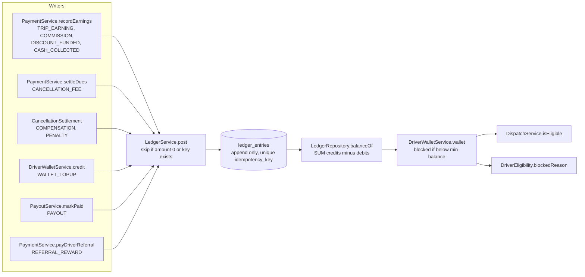
```mermaid
flowchart LR
  subgraph Writers
    A["PaymentService.recordEarnings<br/>TRIP_EARNING, COMMISSION,<br/>DISCOUNT_FUNDED, CASH_COLLECTED"]
    B["PaymentService.settleDues<br/>CANCELLATION_FEE"]
    C["CancellationSettlement<br/>COMPENSATION, PENALTY"]
    D["DriverWalletService.credit<br/>WALLET_TOPUP"]
    E["PayoutService.markPaid<br/>PAYOUT"]
    F["PaymentService.payDriverReferral<br/>REFERRAL_REWARD"]
  end
  A & B & C & D & E & F --> P["LedgerService.post<br/>skip if amount 0 or key exists"]
  P --> L[("ledger_entries<br/>append only, unique idempotency_key")]
  L --> Q["LedgerRepository.balanceOf<br/>SUM credits minus debits"]
  Q --> W["DriverWalletService.wallet<br/>blocked if below min-balance"]
  W --> X["DispatchService.isEligible"]
  W --> Y["DriverEligibility.blockedReason"]
```

- **Write path.** `payment/LedgerService#credit` :35 and `#debit` :41 both go through the private `post`, which skips amounts ≤ 0 and keys that already exist. `uk_ledger_entries_idempotency` (V13) is the backstop. Every entity column is `updatable=false`; the DB requires `amount > 0` and a valid direction.
- **Not strict double-entry.** Each call writes one row. Pairs are posted by convention (for example, cancellation compensation credits the driver and debits the platform). Some are single-sided: `TRIP_EARNING`, and `WALLET_TOPUP` with no balancing entry. The RIDER account type is never used.
- **Balance.** `LedgerRepository#balanceOf` is `SUM(CASE direction='CREDIT' THEN amount ELSE -amount)`. It is always consistent with the entries because nothing is cached.
- **Wallet rule.** `DriverWalletService#wallet` :167: `limit = driver.wallet.min-balance` (default −₹50). A driver below the limit is `blocked` and gets no offers and cannot go on duty. Cash trips drive the balance negative through `CASH_COLLECTED`, because the driver already holds the platform's commission in cash.
- **Top-up concurrency.** The Razorpay order is created before `saveAndFlush`. Two racing requests with the same `Idempotency-Key` both create an order, and the loser's row then fails with 409 on `uk_driver_wallet_topups_idempotency`.
- **Rider dues.** `PaymentService#recordDue` :125 is idempotent per `(source_type, source_id)`. Dues are added to the next `settleTrip` and marked SETTLED immediately, even when that payment is still PROCESSING.
- **Points.** `points/PointsService`. `point_entries` is a signed append-only log with `uk_point_entries_idempotency`. `redeem` :262 caps the spend at `min(requested, balance, fare, 5000)`. The balance check isn't locked, so two concurrent redemptions could overspend. *[not verified]*

> **Payout note**
>
> `PayoutService#createFor` sums `driver_earnings.net`, not the ledger balance, and does not filter by payment method. Cash trips seem to be included in payouts even though the ledger already debited `CASH_COLLECTED`. Ledger-only items (cancellation shares, penalties, top-ups) are left out. Two concurrent `createFor` runs could also claim the same earnings. **[risk]**

## 11. Redis runtime flow

Redis is **not a cache** here. It holds short-lived coordination state that is fine to lose within a couple of minutes. Every call goes through Boot's auto-configured `StringRedisTemplate`. There is no Redis config class, no `@Cacheable`, and no pub/sub. Connection settings: `SPRING_DATA_REDIS_URL` (Render) or `RIDEX_REDIS_HOST/PORT`, timeout 3000 ms, connect timeout 5000 ms.

| Key | Type / value | TTL | Commands | Written / read by | If Redis is down |
|---|---|---|---|---|---|
| `drivers:online` | GEO set, member = DriverProfile id | none | GEOADD, GEORADIUS, GEOPOS, ZREM | `location/DriverPresence` via `DriverDutyService`, `DispatchService`, `RideRequestService`, `ShuttleCrew`, `AdminPeopleQueries` | Exception propagates (no try/catch) |
| `drivers:seen:{driverId}` | string "1" | 2 min | SET EX, EXISTS, DEL | `DriverPresence` | Same |
| `rl:ip:{ip}:{uri}` | counter | 1 min | INCR, EXPIRE on first hit | `platform/ratelimit/RateLimiter#tryConsume` from `RateLimitFilter` | **Fails open**: WARN logged, request allowed |
| `rl:login:{email}` | counter (every attempt, reset on success) | 15 min | INCR, EXPIRE, DEL | `AuthService#login` :189, `#resetPassword` | Fails open |
| `maps:calls:google-maps:{yyyy-MM-dd}` | counter | 2 days | INCR, EXPIRE | `maps/DailyCallBudget#tryConsume` from `GoogleMapsProvider#requireBudget` | Exception propagates out of `MapsService`; no fallback to ORS **[risk]** |
| `shuttle:live:{tripId}` | hash lat, lng, heading, at | 2 min (refreshed) | HSET, EXPIRE, HGETALL, DEL | `shuttle/ShuttleLiveStore` from `ShuttleRunService` | Exception propagates |
| `shuttle:broadcast:{tripId}` | string "1" | 5 s | SET NX EX | `ShuttleLiveStore#claimBroadcast` | Exception propagates |

**Diagram: Who touches Redis**

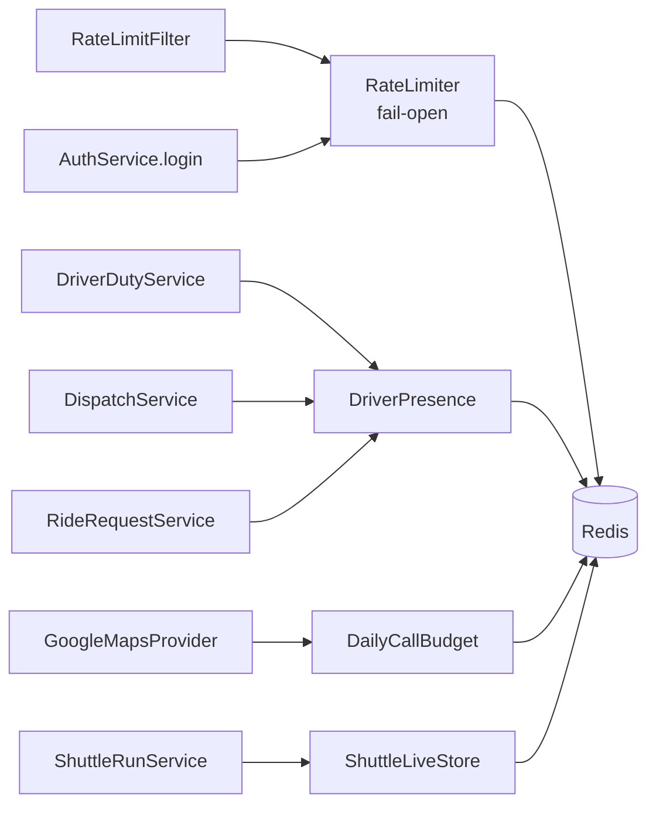
```mermaid
flowchart LR
  RLF["RateLimitFilter"] --> RLM["RateLimiter<br/>fail-open"]
  AUTH["AuthService.login"] --> RLM
  DUTY["DriverDutyService"] --> DP["DriverPresence"]
  DISP["DispatchService"] --> DP
  RIDE["RideRequestService"] --> DP
  GMP["GoogleMapsProvider"] --> DCB["DailyCallBudget"]
  SRS["ShuttleRunService"] --> SLS["ShuttleLiveStore"]
  RLM --> R[("Redis")]
  DP --> R
  DCB --> R
  SLS --> R
```

**Consistency:** nothing in Redis is also written to PostgreSQL in the same transaction. Losing Redis data costs up to 2 minutes of live positions, which re-appear with the next report, and resets rate-limit counters. No money or booking state is ever held only in Redis.

## 12. PostgreSQL / JPA / Hibernate runtime flow

Example: `DispatchService#accept`, a normal `@Transactional` method on a request thread.

**Diagram: Connection and transaction lifecycle for one service call**

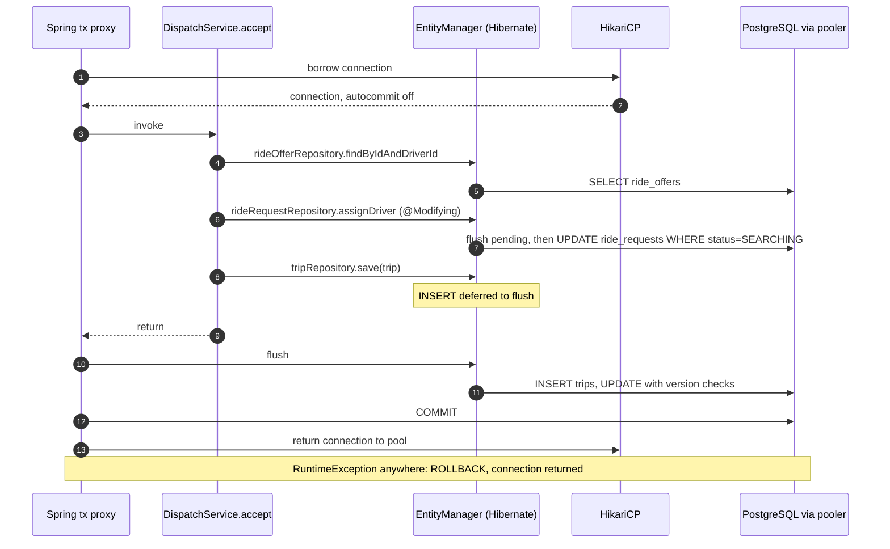
```mermaid
sequenceDiagram
  autonumber
  participant P as Spring tx proxy
  participant S as DispatchService.accept
  participant EM as EntityManager (Hibernate)
  participant H as HikariCP
  participant PG as PostgreSQL via pooler
  P->>H: borrow connection
  H-->>P: connection, autocommit off
  P->>S: invoke
  S->>EM: rideOfferRepository.findByIdAndDriverId
  EM->>PG: SELECT ride_offers
  S->>EM: rideRequestRepository.assignDriver (@Modifying)
  EM->>PG: flush pending, then UPDATE ride_requests WHERE status=SEARCHING
  S->>EM: tripRepository.save(trip)
  Note over EM: INSERT deferred to flush
  S-->>P: return
  P->>EM: flush
  EM->>PG: INSERT trips, UPDATE with version checks
  P->>PG: COMMIT
  P->>H: return connection to pool
  Note over P,PG: RuntimeException anywhere: ROLLBACK, connection returned
```

- **When a connection is taken.** When the `@Transactional` proxy opens the transaction, not when the first query runs. It is held until commit or rollback. With `open-in-view: false` it is never held during JSON serialisation. *[framework]*
- **When SQL runs.** SELECTs run immediately. INSERTs and UPDATEs from `save()` and dirty-checking are queued until a flush. A flush happens before JPQL or native queries that touch the same tables, before a `@Modifying` query, on `saveAndFlush`, and at commit.
- **Where unique-constraint violations surface.** At the flush. That is why `ShuttleService#book` uses `saveAndFlush`: it catches the seat conflict at that point and turns it into a friendly 409.
- **Rollback.** Spring rolls back on `RuntimeException` and `Error`. Every RideX domain exception extends `RuntimeException` via `shared/exception/DomainException`, so any 4xx thrown from a service also rolls back. `REQUIRES_NEW` methods (`AuthSecurityService#record`, `PickupCodeAttempts#recordFailure`, `AuditWriter#write`) commit independently, so their record survives.
- **Pool.** Hikari defaults, except on Render, where the environment sets `maximum-pool-size=5` and `initialization-fail-timeout=60000`. The Supabase pooler on port 5432 is in session mode, so each Hikari connection holds one pooler client.
- **IDs.** ULIDs are assigned in `@PrePersist` via `shared/util/UlidGenerator`, not by database sequences.

## 13. Transaction runtime flow

All `@Transactional` annotations are method-level Spring ones, on services. There are no class-level transactions and no main-code `TransactionTemplate`. The defaults are REQUIRED propagation and read-write.

**Diagram: Commit path vs rollback path**

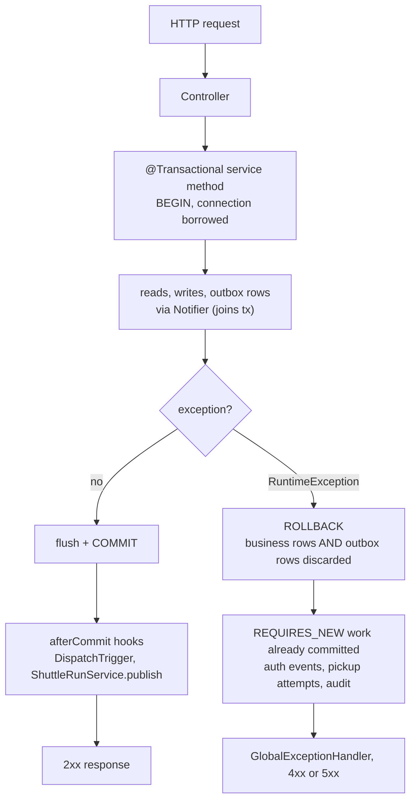
```mermaid
flowchart TD
  A["HTTP request"] --> B["Controller"]
  B --> C["@Transactional service method<br/>BEGIN, connection borrowed"]
  C --> D["reads, writes, outbox rows<br/>via Notifier (joins tx)"]
  D --> E{"exception?"}
  E -- no --> F["flush + COMMIT"]
  F --> G["afterCommit hooks<br/>DispatchTrigger, ShuttleRunService.publish"]
  G --> H["2xx response"]
  E -- "RuntimeException" --> I["ROLLBACK<br/>business rows AND outbox rows discarded"]
  I --> J["REQUIRES_NEW work already committed<br/>auth events, pickup attempts, audit"]
  J --> K["GlobalExceptionHandler, 4xx or 5xx"]
```

### Important boundaries

| Method | Propagation | Why it matters |
|---|---|---|
| `RideRequestService#create`, `#cancel`, `#cancelAsDriver` | REQUIRED | Ride, points and dues change together. |
| `DispatchService#offerFirstWave`, `#offerRide` | **REQUIRES_NEW** | Called from `afterCommit` (where the outer transaction is finished) and from the sweep. Each wave commits on its own. |
| `DispatchService#accept` | REQUIRED | Assignment, offer claim and Trip creation are atomic. |
| `TripService#complete` | REQUIRED | Fare, payment, ledger, receipt outbox and points are one unit. It includes a Razorpay HTTP call. |
| `PaymentWebhookService#handle` | REQUIRED | Event row, status and seat/pass settlement are one unit, so a retry is safe. |
| `OutboxDispatcher#dispatchPending` | REQUIRED | Claims up to 50 rows with SKIP LOCKED and sends **inside** the transaction. |
| `AuthSecurityService#record`, `#respondToTokenReuse`, `PickupCodeAttempts#recordFailure`, `AuditWriter#write` | **REQUIRES_NEW** | The security or audit record survives the caller's rollback. |

### External calls inside transactions

| Transaction | External call | Worst-case hold | Consequence |
|---|---|---|---|
| `FareEstimateService#estimate` | Google Distance Matrix, then ORS | ~5 s + 8 s | A DB connection is held idle. With a pool of 5, a few slow estimates starve other requests. |
| `TripService#complete` → `settleTrip` | Razorpay `POST /v1/orders` | 5 s + 10 s | A Razorpay outage makes online rides impossible to complete (503 and full rollback). |
| `ShuttleService#book`, `PassService#buy`, `DriverWalletService#startTopUp` | Razorpay `POST /v1/orders` | 15 s | A later rollback orphans the order. |
| `*#confirm*` (ride, shuttle, pass, top-up) | Razorpay `GET /v1/payments/{id}` | 15 s | If the DB write fails after capture, the webhook is the recovery path. |
| `OutboxDispatcher#dispatchPending` | SMTP and Expo for up to 50 rows | 50 × (5 s SMTP timeouts) | Row locks and a connection are held for the whole batch. |
| `DriverDocumentService#submit` | Supabase Storage upload | No explicit timeout | A hung bucket upload holds the connection. *[not verified]* |

## 14. Outbox / event runtime flow

RideX has no in-process events. Every "something happened, tell someone" step is an **outbox row** written in the same transaction as the business change. A notification can't be sent for a change that rolled back, and a committed change can't lose its notification.

**Diagram: Transactional outbox**

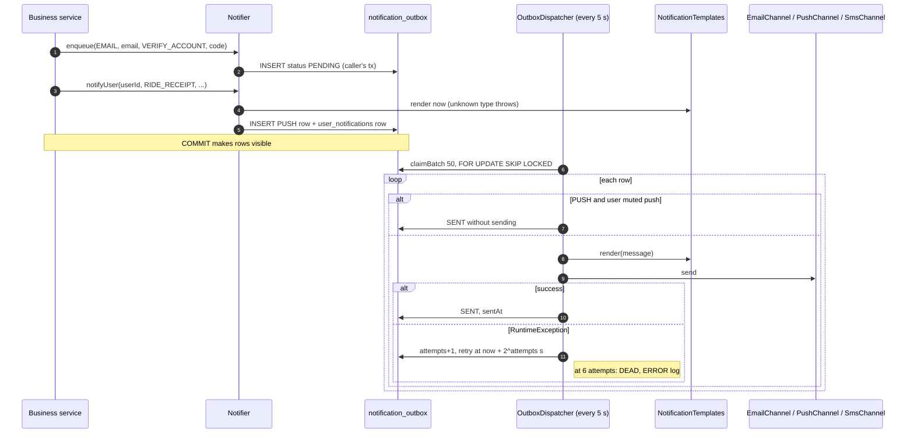
```mermaid
sequenceDiagram
  autonumber
  participant BS as Business service
  participant N as Notifier
  participant DB as notification_outbox
  participant OD as OutboxDispatcher (every 5 s)
  participant T as NotificationTemplates
  participant CH as EmailChannel / PushChannel / SmsChannel
  BS->>N: enqueue(EMAIL, email, VERIFY_ACCOUNT, code)
  N->>DB: INSERT status PENDING (caller's tx)
  BS->>N: notifyUser(userId, RIDE_RECEIPT, ...)
  N->>T: render now (unknown type throws)
  N->>DB: INSERT PUSH row + user_notifications row
  Note over BS,DB: COMMIT makes rows visible
  OD->>DB: claimBatch 50, FOR UPDATE SKIP LOCKED
  loop each row
    alt PUSH and user muted push
      OD->>DB: SENT without sending
    else
      OD->>T: render(message)
      OD->>CH: send
      alt success
        OD->>DB: SENT, sentAt
      else RuntimeException
        OD->>DB: attempts+1, retry at now + 2^attempts s
        Note right of OD: at 6 attempts: DEAD, ERROR log
      end
    end
  end
```

- **Schema**: `notification_outbox` (V4) with index `idx_notification_outbox_claim (status, next_attempt_at)`. Status `OutboxStatus`: PENDING, SENT, DEAD. Channel `DeliveryChannel`: EMAIL, SMS, PUSH.
- **Claiming**: `OutboxRepository#claimBatch` uses `@Lock(PESSIMISTIC_WRITE)` with lock timeout `-2`, which Hibernate turns into SKIP LOCKED. Several app instances can therefore run the dispatcher without double-sending. It is the only pessimistic lock in the codebase.
- **Retry**: waits of 2, 4, 8, 16 and 32 s. The 6th failure marks the row DEAD. Nothing re-drives DEAD rows.
- **Switch**: `app.outbox.enabled` (default true), turned off in the Maven Surefire test run. `app.outbox.poll-ms` defaults to 5000.
- **Delivery semantics**: at least once. If the send succeeds but the commit fails, the row stays PENDING and is sent again.

## 15. Scheduled / background jobs

All five jobs share Boot's default scheduler, which has **one thread**. A slow outbox batch (SMTP timeouts) therefore delays the dispatch sweep and hold expiry. `fixedDelay` means the next run is scheduled from the end of the previous one, so a job never overlaps itself. *[framework]*

| Job | Trigger | Switch | What it does | Touches |
|---|---|---|---|---|
| `dispatch/DispatchSweep#scheduledSweep` :53 | fixedDelay `app.dispatch.sweep-ms` = 5000 | `app.dispatch.sweep-enabled` (off in tests) | Expires overdue offers, advances waves, expires stale searches | PostgreSQL, Redis GEO, STOMP |
| `notification/OutboxDispatcher#dispatchPending` :46 | fixedDelay `app.outbox.poll-ms` = 5000 | `app.outbox.enabled` (off in tests) | Sends up to 50 outbox rows | PostgreSQL, SMTP, Expo |
| `shuttle/ShuttleService#releaseExpiredHolds` :521 | fixedDelay `app.shuttle.hold-sweep-ms` = 60000 | none | Unpaid seats past their 10-minute hold become CANCELLED / EXPIRED; the payment is voided | PostgreSQL |
| `driver/DriverDocumentService#expireLapsedDocuments` :165 | fixedDelay `app.documents.expiry-sweep-ms` = 3600000 | none | APPROVED documents past `expiresAt` become EXPIRED | PostgreSQL |
| `auth/ExpiredTokenCleanup#deleteExpiredRefreshTokens` | cron `0 30 3 * * *` (03:30 in the JVM zone, Asia/Kolkata) | none | Deletes refresh tokens that expired more than 7 days ago | PostgreSQL |

Each job is also `@Transactional`, so each run is one database transaction. The only work that runs off both the request thread and the scheduler is the `afterCommit` callback, and that runs on the request thread after the commit.

## 16. WebSocket / STOMP runtime flow

`platform/realtime/WebSocketConfig` configures:

- raw WebSocket on `/ws` (no SockJS), allowed origins `*`;
- the simple in-memory broker on `/topic` and `/queue`;
- application prefix `/app` and user prefix `/user`.

The HTTP handshake is `permitAll`. Authentication happens on the STOMP `CONNECT` frame. Clients never send application messages; the server only pushes.

**Diagram: Connect, subscribe, receive**

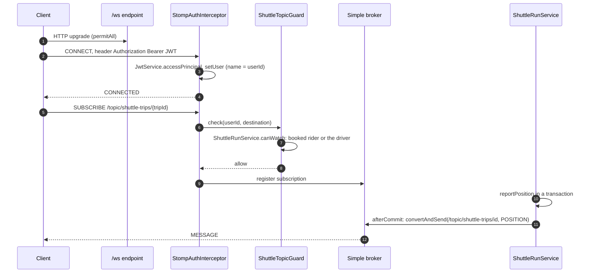
```mermaid
sequenceDiagram
  autonumber
  participant C as Client
  participant WS as /ws endpoint
  participant AI as StompAuthInterceptor
  participant G as ShuttleTopicGuard
  participant B as Simple broker
  participant SV as ShuttleRunService
  C->>WS: HTTP upgrade (permitAll)
  C->>AI: CONNECT, header Authorization Bearer JWT
  AI->>AI: JwtService.accessPrincipal, setUser (name = userId)
  AI-->>C: CONNECTED
  C->>AI: SUBSCRIBE /topic/shuttle-trips/{tripId}
  AI->>G: check(userId, destination)
  G->>G: ShuttleRunService.canWatch: booked rider or the driver
  G-->>AI: allow
  AI->>B: register subscription
  SV->>SV: reportPosition in a transaction
  SV->>B: afterCommit: convertAndSend(/topic/shuttle-trips/id, POSITION)
  B-->>C: MESSAGE
```

| Destination | Payload | Published by | When | Guarded? |
|---|---|---|---|---|
| `/user/{name}/queue/offers` | `OfferResponse` | `StompOfferNotifier#offered` | Each new offer; sent before commit | User destination, but addressed with the wrong id **[defect]** |
| `/topic/rides/{rideId}` | `OfferTaken("OFFER_TAKEN", ...)` / `("SEARCH_EXPIRED", ...)` | `StompOfferNotifier#taken`, `#searchGaveUp` | Accept (before commit), sweep give-up | No **[defect]** |
| `/topic/shuttle-trips/{tripId}` | `ShuttleLiveResponse` event STARTED, POSITION, STOP_REACHED, FINISHED | `ShuttleRunService#publish` :187 | **afterCommit**; POSITION at most every 5 s (`claimBroadcast`) | Yes, `ShuttleTopicGuard` |

**Scaling limit:** the simple broker lives in memory in one JVM. With two instances, a message published on one never reaches sockets on the other. The comment in `WebSocketConfig` says a broker relay is needed before scaling out.

## 17. Notification / email runtime flow

- **Templates are Java.** `notification/NotificationTemplates#render` is a switch on the event type. `src/main/resources/mail/` holds only `logo.png`. An unknown event type throws. Because `notifyUser` renders synchronously, that exception rolls back the business transaction.
- **Email.** `notification/EmailChannel#send` uses `JavaMailSender`. It sends multipart text + HTML, with the inline logo as CID `ridex-logo` and an optional attachment. From address: `RIDEX_MAIL_FROM` / `RIDEX_MAIL_FROM_NAME`; footer: `RIDEX_MAIL_SUPPORT`. SMTP timeouts are 5 s. On Render the relay is Brevo on port 2525 with STARTTLS.
- **PDF invoice.** `notification/InvoicePdf#render` (PDFBox) runs at *send* time for `SHUTTLE_INVOICE` only, and is attached as `ridex-invoice-<ref>.pdf`. The ride receipt is HTML only.
- **Push.** `notification/push/PushChannel#send` posts to Expo at `https://exp.host/--/api/v2/push/send` (5 s timeouts, no credential), once per device token from `device_tokens`. Tokens are registered through `PUT /api/v1/devices`. Expo's per-ticket errors are not read. A user with no devices counts as success.
- **SMS.** `SmsChannel` is a stub that only logs. No code enqueues SMS.
- **In-app feed.** `notifyUser` also writes `user_notifications`, which is read by `NotificationFeedService` (`/api/v1/notifications`).
- **Preferences.** `notification_preferences` has `push`, `email` and `promotions`. Only `push` is checked (`OutboxDispatcher#muted`). **[defect]**

| Event type | Channels | Enqueued from |
|---|---|---|
| VERIFY_ACCOUNT, RESET_PASSWORD, ACCOUNT_EXISTS, WELCOME | EMAIL | `AuthService#issueOtp`, `#register`, `#verifyEmail` |
| DRIVER_UNDER_REVIEW / APPROVED / REJECTED / SUSPENDED | EMAIL + push + feed | `DriverOnboardingService#notify` |
| DOCUMENT_APPROVED / DOCUMENT_REJECTED | EMAIL + push + feed | `DriverDocumentService#review` |
| RIDE_RECEIPT | EMAIL + push + feed | `TripService#emailReceipt` from `#complete` |
| RIDE_CANCELLED_BY_DRIVER | push + feed | `RideRequestService#cancelAsDriver` |
| REFUNDED_AS_POINTS | push + feed | `RefundService#refundAsPoints` |
| SHUTTLE_BOOKED, SHUTTLE_INVOICE (email with PDF) | push + feed; EMAIL | `ShuttleService#announce` |
| SHUTTLE_STARTED, TWO_STOPS_AWAY, ARRIVING, BOARDED, DEPARTURE_CANCELLED | push + feed | `ShuttleRunService`, `DriverShuttleService#board`, `ShuttleService#cancelDeparture` |

## 18. Exception / error runtime flow

Errors are produced in two places. **Filters** answer directly, before any controller. **`platform/error/GlobalExceptionHandler`** (`@RestControllerAdvice`) handles everything thrown from controllers and services. Both return RFC 7807 `application/problem+json`.

**Diagram: Where each error is produced**

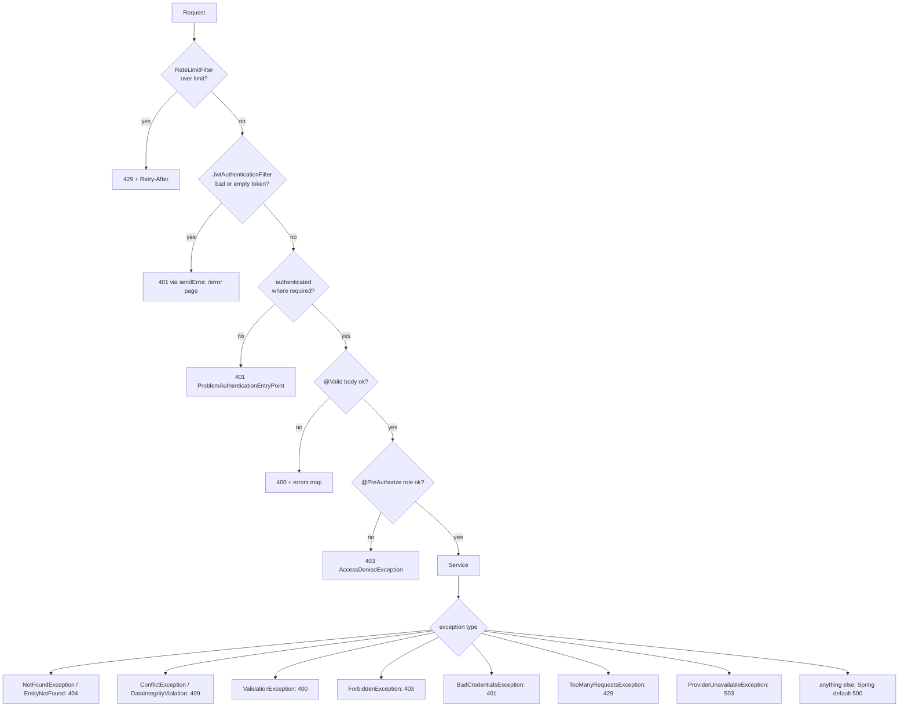
```mermaid
flowchart TD
  A["Request"] --> B{"RateLimitFilter<br/>over limit?"}
  B -- yes --> B1["429 + Retry-After"]
  B -- no --> C{"JwtAuthenticationFilter<br/>bad or empty token?"}
  C -- yes --> C1["401 via sendError, /error page"]
  C -- no --> D{"authenticated<br/>where required?"}
  D -- no --> D1["401 ProblemAuthenticationEntryPoint"]
  D -- yes --> E{"@Valid body ok?"}
  E -- no --> E1["400 + errors map"]
  E -- yes --> F{"@PreAuthorize role ok?"}
  F -- no --> F1["403 AccessDeniedException"]
  F -- yes --> G["Service"]
  G --> H{"exception type"}
  H --> H1["NotFoundException / EntityNotFound: 404"]
  H --> H2["ConflictException / DataIntegrityViolation: 409"]
  H --> H3["ValidationException: 400"]
  H --> H4["ForbiddenException: 403"]
  H --> H5["BadCredentialsException: 401"]
  H --> H6["TooManyRequestsException: 429"]
  H --> H7["ProviderUnavailableException: 503"]
  H --> H8["anything else: Spring default 500"]
```

| Exception | Status | Detail sent | Typical source |
|---|---|---|---|
| `MethodArgumentNotValidException` | 400 | "Request validation failed" + `errors` {field: message} | Any `@Valid` DTO |
| `ValidationException` (shared) | 400 | message | Business rules, e.g. wrong current password |
| `BadCredentialsException` | 401 | message | Login, OTP, refresh |
| `ForbiddenException`, `AccessDeniedException` | 403 | message | Not the owner, wrong role, account not ACTIVE |
| `NotFoundException`, `EntityNotFoundException` | 404 | message | Missing or foreign ids |
| `ConflictException` | 409 | message | Illegal state transition, ride already taken, outstanding payment |
| `DataIntegrityViolationException` | 409 | fixed: "That conflicts with an existing record." | Unique or exclusion constraint at flush |
| `TooManyRequestsException` | 429 | message | Per-account login limit |
| `ProviderUnavailableException` | 503 | fixed: "A service RideX depends on is unavailable..." | Razorpay or maps unreachable or unconfigured |
| Anything else | 500 | Spring default error body | e.g. `ObjectOptimisticLockingFailureException`, Redis errors *[not verified]* |

The webhook throws `ResponseStatusException(401)` for a bad signature, and answers 400 for a missing event id. There is no catch-all `@ExceptionHandler(Exception.class)`, so a stack trace never reaches the client, and unexpected errors fall through to Boot's default `/error` handling.

## 19. Observability runtime flow

**Diagram: Metrics path**

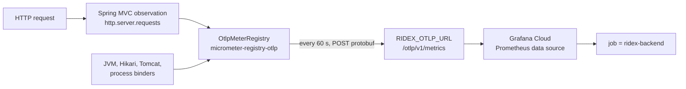
```mermaid
flowchart LR
  A["HTTP request"] --> B["Spring MVC observation<br/>http.server.requests"]
  B --> C["OtlpMeterRegistry<br/>micrometer-registry-otlp"]
  J["JVM, Hikari, Tomcat,<br/>process binders"] --> C
  C -->|"every 60 s, POST protobuf"| D["RIDEX_OTLP_URL<br/>/otlp/v1/metrics"]
  D --> E["Grafana Cloud<br/>Prometheus data source"]
  E --> F["job = ridex-backend"]
```

- **What exists.**
  - Boot's automatic metrics: `http.server.requests` with percentile histograms (`management.metrics.distribution.percentiles-histogram`), JVM memory, GC and threads, `hikaricp_*`, Tomcat, and process CPU.
  - The resource attribute `service.name=ridex-backend` (from `spring.application.name`), which Grafana shows as `job="ridex-backend"`.
- **What doesn't exist.** No custom metrics (`MeterRegistry`, `@Timed` and `Observation` are unused). No tracing dependency (no micrometer-tracing, Brave or Zipkin). No log shipping. Whether `spring-boot-opentelemetry` alone exports anything besides metrics: *[not verified]*. No trace export was seen in the local test.
- **Configuration.** `management.otlp.metrics.export.{enabled,url,headers.Authorization,step}`, from `RIDEX_OTLP_ENABLED`, `RIDEX_OTLP_URL` (must end in `/v1/metrics`), and `RIDEX_OTLP_AUTH` (`Basic` + base64 of `instanceId:token`).
- **Why push, not scrape.** A Render service has no private network a scraper could reach, and a public `/actuator/prometheus` would publish internals (comment in `application.yml`).
- **Startup signal.** `Publishing metrics for OtlpMeterRegistry every 1m to ...` in the log. If this line is missing, the exporter is not running.
- **Health.** `/actuator/health` only. Mail and Redis health are disabled on purpose, so neither an outbox or mail outage nor a Redis blip marks the instance DOWN and triggers a rollback.

## 20. Deployment runtime flow

**Diagram: From git push to a ready container**

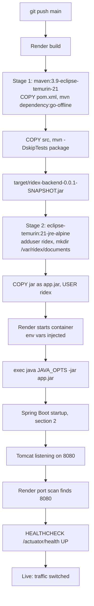
```mermaid
flowchart TD
  A["git push main"] --> B["Render build"]
  B --> C["Stage 1: maven:3.9-eclipse-temurin-21<br/>COPY pom.xml, mvn dependency:go-offline"]
  C --> D["COPY src, mvn -DskipTests package"]
  D --> E["target/ridex-backend-0.0.1-SNAPSHOT.jar"]
  E --> F["Stage 2: eclipse-temurin:21-jre-alpine<br/>adduser ridex, mkdir /var/ridex/documents"]
  F --> G["COPY jar as app.jar, USER ridex"]
  G --> H["Render starts container<br/>env vars injected"]
  H --> I["exec java JAVA_OPTS -jar app.jar"]
  I --> J["Spring Boot startup, section 2"]
  J --> K["Tomcat listening on 8080"]
  K --> L["Render port scan finds 8080"]
  L --> M["HEALTHCHECK /actuator/health UP"]
  M --> N["Live: traffic switched"]
```

- **Two stages.** The runtime image carries only a JRE and one jar. Dependencies are resolved from `pom.xml` alone, so a code change doesn't re-download them. Tests are skipped in the image build because they need a real PostgreSQL and Redis.
- **Non-root.** The app runs as `ridex`. `/var/ridex/documents` is owned by it, so a mounted volume inherits that ownership. On Render, KYC documents go to the Supabase bucket instead, because the container disk is wiped on every deploy.
- **Environment (names only).**
  - Datasource: `SPRING_DATASOURCE_URL/USERNAME/PASSWORD`. The pooler username must be `postgres.<project-ref>`.
  - Hikari: `SPRING_DATASOURCE_HIKARI_INITIALIZATIONFAILTIMEOUT`, `SPRING_DATASOURCE_HIKARI_MAXIMUM_POOL_SIZE`.
  - Redis: `SPRING_DATA_REDIS_URL`.
  - App: `RIDEX_JWT_SECRET`, `RIDEX_CORS_ALLOWED_ORIGINS`, `RIDEX_MAIL_*`, `RIDEX_BUCKET_*`, `RAZORPAY_*`, `GOOGLE_MAPS_API_KEY`, `RIDEX_OTLP_*`, `RIDEX_BOOTSTRAP_ADMIN_*`, `JAVA_OPTS`.
- **Shutdown.** Render sends SIGTERM. `exec` makes Java PID 1, so the JVM receives the signal directly. Boot closes the context: the scheduler stops, Hikari closes its connections, and Tomcat stops accepting. Graceful shutdown (`server.shutdown=graceful`) is not configured, so requests in flight may be cut. An outbox batch in progress rolls back and its rows are retried by the next instance. *[not verified]*
- **Free-tier behaviour.** The instance sleeps when idle and cold-starts in about 60 s. At 0.1 CPU, the first TLS handshake to the Supabase pooler can take longer than the pooler's ~2.5 s window; the Hikari retry setting above covers that.

## 21. End-to-end request trace: accepting a ride offer

This request touches the most layers: `POST /api/v1/driver/offers/{offerId}/accept`, sent by the partner app. Open each file in order.

1. **HTTP in.** Render forwards to Tomcat on :8080. A worker thread picks up the request.
2. **FilterChainProxy** applies CORS (`/api/**`) and security headers. 
   Code: `platform/security/SecurityConfig#securityFilterChain :65, #corsConfigurationSource :108`
3. **RateLimitFilter#shouldNotFilter** returns true, because this path isn't rate-limited. No Redis call. 
   Code: `platform/ratelimit/RateLimitFilter`
4. **JwtAuthenticationFilter#doFilterInternal** → `JwtService#accessPrincipal` → `JwtPrincipal#toAuthentication`. The SecurityContext now holds userId and `ROLE_DRIVER`. 
   Code: `platform/security/JwtAuthenticationFilter, JwtService ~:78, JwtPrincipal`
5. **AuthorizationFilter**: the path isn't public, and the caller is authenticated, so it continues.
6. **DispatcherServlet** maps the request to `DriverDispatchController` and binds `@PathVariable offerId` and `@AuthenticationPrincipal JwtPrincipal`. 
   Code: `dispatch/DriverDispatchController`
7. **Method security**: class-level `@PreAuthorize("hasRole('DRIVER')")` passes.
8. **Controller** resolves the caller's DriverProfile and calls `DispatchService#accept`.
9. **Transaction begins.** The `@Transactional` proxy borrows a Hikari connection and turns autocommit off. 
   Code: `dispatch/DispatchService#accept :123`
10. **Load and check the offer.** `RideOfferRepository#findByIdAndDriverId` (SELECT), then `offer.isLiveAt(now)`. A dead offer gives 409.
11. **The race is decided here.** `RideRequestRepository#assignDriver` runs `UPDATE ride_requests SET status='DRIVER_ASSIGNED', assigned_driver_id=?, assigned_at=? WHERE id=? AND status='SEARCHING'`. Zero rows means another driver won: `ConflictException`, 409, rollback.
12. **Offer bookkeeping.** `RideOfferRepository#claim` (to ACCEPTED), then `#supersedeOthers` (other live offers to SUPERSEDED). Both are conditional UPDATEs.
13. **Trip.** `TripService#createForAssignedRide` :84 joins the transaction. It generates the pickup code (`OtpGenerator`), stores its BCrypt hash plus the plaintext in `trips.pickup_code`, saves the `Trip`, and records `TripStatusHistory(null → DRIVER_ASSIGNED)`. The INSERTs are queued until flush. 
    Code: `trip/TripService#createForAssignedRide :84`
14. **Realtime.** `StompOfferNotifier#taken` sends `OFFER_TAKEN` to `/topic/rides/{rideId}`. This happens before commit; if the commit then fails, subscribers have already been told. 
    Code: `platform/realtime/StompOfferNotifier#taken`
15. **Commit.** Hibernate flushes: INSERT `trips` (`uk_trips_ride_request` is the backstop) and INSERT `trip_status_history`. COMMIT. The connection goes back to Hikari.
16. **Response.** The controller returns `OfferResponse` with `tripId`, and Jackson serialises it to JSON. The `finally` in the JWT filter clears the SecurityContext. The worker thread is free.
17. **Afterwards.** The rider app polls `GET /api/v1/rides/{id}` and sees DRIVER_ASSIGNED, the driver card with the live Redis position, and the pickup code (`RideRequestService#pickupCodeFor`). No outbox row is written at accept; the first notification in this ride's life is `RIDE_RECEIPT` at completion.

## 22. Class / component dependency map

**Diagram: Feature packages and what they call**

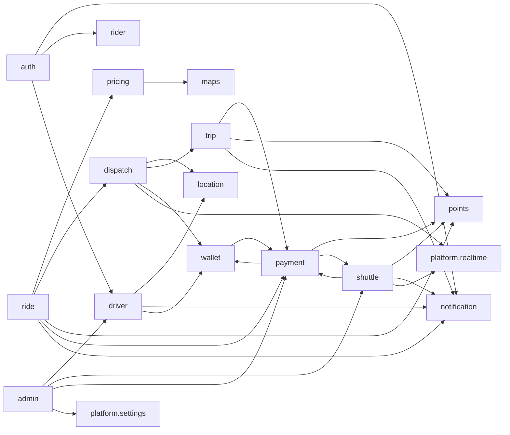
```mermaid
flowchart LR
  auth --> notification
  auth --> rider
  auth --> driver
  pricing --> maps
  ride --> pricing
  ride --> dispatch
  ride --> points
  ride --> payment
  ride --> notification
  dispatch --> location
  dispatch --> trip
  dispatch --> wallet
  dispatch --> realtime["platform.realtime"]
  trip --> payment
  trip --> points
  trip --> notification
  payment --> points
  payment --> shuttle
  payment --> wallet
  wallet --> payment
  shuttle --> payment
  shuttle --> points
  shuttle --> notification
  shuttle --> realtime
  driver --> location
  driver --> notification
  driver --> wallet
  admin --> driver
  admin --> shuttle
  admin --> payment
  admin --> settings["platform.settings"]
```

The edges were derived from the service calls traced above; imports were not exhaustively scanned. `payment` and `shuttle` depend on each other: the webhook settles seats, and seats start payments. ArchUnit (`src/test/.../architecture/PackageStructureTest`) enforces only three rules:

- `..domain..` doesn't use Spring or the servlet API;
- `..domain..` doesn't use `..dto..` or `..platform..`;
- `auth` doesn't reach into the trip, payment or dispatch domains.

### URL → controller

| Base path | Controller | Access |
|---|---|---|
| `/api/v1/auth` | `auth/AuthController` | public subset + authenticated |
| `/api/v1/rides` | `ride/RideController`, `pricing/RideEstimateController` | RIDER |
| `/api/v1/rider`, `/api/v1/rider/places` | `rider/RiderController`, `places/SavedPlaceController` | RIDER |
| `/api/v1/shuttle` | `shuttle/ShuttleController` | RIDER |
| `/api/v1/points`, `/maps`, `/notifications`, `/devices`, `/support/tickets` | `PointsController`, `MapsController`, `NotificationController`, `DeviceTokenController`, `SupportController` | any authenticated |
| `/api/v1/legal` | `legal/LegalController` | public |
| `/api/v1/payments/webhook` | `payment/PaymentWebhookController` | public, HMAC-checked |
| `/api/v1/driver` (+ `/documents`, `/vehicles`, `/earnings`, `/wallet`, `/shuttle`) | `DriverController`, `DriverDispatchController`, `DriverDocumentController`, `VehicleController`, `DriverEarningsController`, `DriverWalletController`, `DriverShuttleController` | DRIVER |
| `/api/v1/trips` | `trip/TripController` | DRIVER |
| `/api/v1/admin/**` | 12 admin controllers (`AdminQuery`, `AdminDriver`, `AdminShuttle*`, `AdminPass`, `AdminPayout`, `AdminRefund`, `AdminPricing`, `AdminSettings`, `AdminLegal`, `AdminSupport`, `AdminWallet`) | SUPPORT / OPS_ADMIN / SUPER_ADMIN; audited via `@Audited` → `AuditInterceptor` → `AuditWriter` (`REQUIRES_NEW`, only after success) |

## 23. Runtime failure points

| Dependency / point | Symptom | What the code does | Where to look |
|---|---|---|---|
| PostgreSQL at startup | `SSL error: Remote host terminated the handshake`, exit 1 | Hikari retries only if `initialization-fail-timeout` is above 1. At 0.1 CPU the first handshake exceeds the pooler's ~2.5 s window. | Render logs around `HikariPool-1 - Starting` |
| Weak JWT secret | Startup `IllegalStateException` | Refuses to start, by design | `JwtService` constructor |
| Migration drift | Flyway validate failure, or Hibernate validate failure | Startup aborts | `db/migration`, entity mappings |
| Redis down | Rate limits disabled; duty, location, dispatch and shuttle live calls fail with 500 | Only `RateLimiter` fails open | WARN "Rate limit check failed" |
| Razorpay down or unconfigured | 503 on online completion, booking and confirm | Whole transaction rolls back | `ProviderUnavailableException` |
| Maps down / over budget | Estimate falls back Google → ORS; geocoding → Nominatim | A Redis error in the budget is not a fallback trigger | `maps/MapsService#attempt` |
| SMTP / Expo down | Notifications delayed; after 6 tries DEAD | Outbox retries with backoff; holds its transaction during sends | `notification_outbox.last_error`, `status='DEAD'` |
| Slow scheduler job | Dispatch waves and hold expiry lag | All five jobs share one thread | Log timestamps of each job |
| Two app instances | STOMP messages lost across instances | In-memory broker; outbox is multi-instance safe; sweep is not coordinated | `WebSocketConfig` comment |
| Driver never sees offers live | Offers only appear after polling | User destination is addressed with the DriverProfile id instead of the user id | `DispatchService.java:115` |
| Late `payment.failed` webhook | A paid payment shows FAILED | No guard in `apply` | `PaymentWebhookService#apply` :108 |
| Supabase bucket hang | Document upload hangs | No explicit timeout on the bucket `RestClient` | `driver/DocumentStorage` |

## 24. Glossary

- **AppContext**: The surface a user logged into: RIDER, DRIVER or ADMIN. It limits which roles the JWT carries.
- **afterCommit**: A `TransactionSynchronization` callback that runs on the same thread only once the transaction has committed. It is used to start dispatch and to publish shuttle updates.
- **Dues**: Cancellation fees owed by a rider (`rider_dues`), collected with their next fare.
- **Estimate**: A 5-minute fare quote per ride type (`fare_estimates`). It is the idempotency key for booking.
- **Flush**: The moment Hibernate sends queued INSERTs and UPDATEs to PostgreSQL. Constraint violations appear here, not at `save()`.
- **Hold**: The 10-minute reservation on an unpaid shuttle seat, released by `releaseExpiredHolds`.
- **JwtPrincipal**: The authenticated user for one request: userId, email, roles and app. Its name is the userId.
- **Ledger**: Append-only money movements (`ledger_entries`). The driver wallet is its DRIVER sum.
- **Outbox**: `notification_outbox`: messages written with the business change and sent later by the scheduler.
- **Pickup code**: A 6-digit code the rider shows the driver to start the trip. It burns after 5 wrong tries.
- **Pooler**: Supabase Supavisor. Its session mode on port 5432 is what the JDBC URL points at.
- **REQUIRES_NEW**: Suspends the caller's transaction and commits its own, used for records that must survive a rollback.
- **SKIP LOCKED**: PostgreSQL row-lock mode that lets parallel outbox workers skip rows another worker has already claimed.
- **Sweep**: `DispatchSweep`'s 5-second tick that expires offers and moves searches to the next wave.
- **Wave**: One round of dispatch offers. The radius and driver count grow with each wave, up to 4.
- **ULID**: Sortable 26-character id generated in `@PrePersist`; used as every primary key.

Traced from source by reading every package under `com.ridex`, the Dockerfile, `application.yml`, `pom.xml` and migrations V1–V44. Items marked *[not verified]* follow from the code but were not run. Re-check line numbers after later commits.
